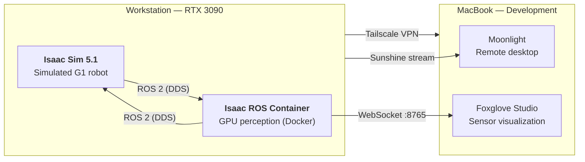
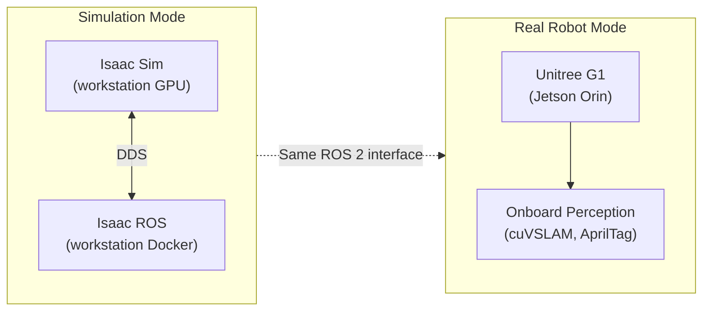
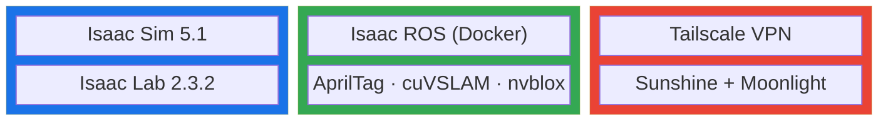

---
hide:
  - navigation
  - toc
---

# Getting Started

Robotics simulation and perception stack for the **Unitree G1** humanoid robot using **NVIDIA Isaac Sim**, **Isaac ROS**, and an **RTX 3090 workstation**.

---

## System Overview

The workstation runs two main components:

- **Isaac Sim** — NVIDIA's robot simulator. Renders a 3D world with accurate physics and simulates the G1's sensors (cameras, IMU, lidar). Publishes the same ROS 2 topics as the real robot.
- **Isaac ROS** — GPU-accelerated perception packages running in a Docker container. Receives sensor data from the simulator, runs SLAM, AprilTag detection, and 3D mapping on the GPU.

These communicate over **ROS 2** (DDS), and results are visualized remotely via **Foxglove Studio** in a browser.

---

## Simulation vs Real Robot

| | Simulation | Real Robot |
|---|---|---|
| **Runs on** | Workstation (RTX 3090) | G1's Jetson Orin |
| **Sensor source** | Simulated in Isaac Sim | Physical cameras, IMU |
| **Perception** | Isaac ROS container | Onboard Orin GPU |
| **ROS 2 topics** | Identical interface | Identical interface |

The simulated and real robots publish the same ROS 2 topics — perception code works without modification in both modes.

---

## Software Stack

| Component | Purpose |
|---|---|
| **ROS 2 Jazzy** | Middleware — nodes publish/subscribe to topics over DDS |
| **Isaac Sim** | Physics simulator with GPU rendering and sensor simulation |
| **Isaac Lab** | Robot learning framework — trains RL policies on Isaac Sim |
| **Isaac ROS** | GPU-accelerated perception (SLAM, AprilTag, nvblox) in Docker |
| **Foxglove** | Browser-based visualization of all ROS 2 data |
| **Tailscale** | Mesh VPN for remote access between Toronto and Kingston |
| **Sunshine** | GPU-accelerated remote desktop streaming via Moonlight |

---

## Documentation Map

Each major component has its own section with setup instructions, configuration details, and troubleshooting:

-   :material-cube-outline:{ .lg .middle } **[Simulation](../simulation/index.md)**

    ---

    Isaac Sim, Isaac ROS, ROS 2 bridge, GPU perception

-   :material-server:{ .lg .middle } **[Infrastructure](../infrastructure/index.md)**

    ---

    Workstation, networking, streaming, and command reference

-   :material-graph:{ .lg .middle } **[Architecture](architecture.md)**

    ---

    Detailed data flow diagrams for simulation and real robot modes

-   :material-chart-timeline:{ .lg .middle } **[Project](../project/index.md)**

    ---

    Progress updates, blog posts, and about this site

