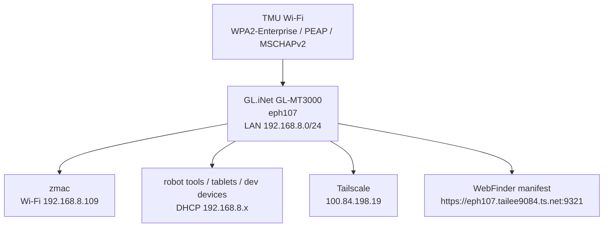

# Field Router

Portable GL.iNet router setup for school / lab work.

## Role

The field router is the preferred network layer when working at TMU. It joins the university Wi-Fi as a WPA2-Enterprise client, then provides a private lab LAN for the Mac, robot-adjacent devices, and tooling.

This replaces the older pattern where the Mac was the main internet-sharing router.



## Current Router State

| Item | Value |
|---|---|
| Hardware | GL.iNet GL-MT3000 / Beryl AX |
| Hostname | `eph107` |
| LAN IP | `192.168.8.1/24` |
| Tailscale IP | `100.84.198.19` |
| Firmware | OpenWrt 24.10.4 / GL.iNet OpenWrt 24 build |
| Tailscale | 1.98.4 static arm64 binary |
| Web UI | `https://eph107.tailee9084.ts.net/` or `http://192.168.8.1/` on LAN |
| SSH | key-only as `root`; password SSH disabled |
| Router password | stored locally in macOS Keychain as `gl-mt3000-router-password` |

Do not commit the TMU account password or router admin password to this repo.

## Wi-Fi Layout

| Band | Role | Notes |
|---|---|---|
| 5 GHz | TMU uplink + GL.iNet AP | The router is associated to `TMU` as `phy1-sta0` and also broadcasts the private 5 GHz SSID. |
| 2.4 GHz | GL.iNet AP | Useful for devices that need range or have weaker 5 GHz support. |

The 5 GHz uplink was selected because TMU was visible around `-48 dBm` during setup. Use 2.4 GHz uplink only if 5 GHz becomes unstable in a different room.

## TMU WPA2-Enterprise Settings

The router uses the same settings as TMU's Linux instructions:

| Setting | Value |
|---|---|
| SSID | `TMU` |
| Security | WPA2-Enterprise / 802.1X |
| EAP method | PEAP |
| Inner authentication | MSCHAPv2 |
| CA certificate | `/etc/ssl/certs/ca-certificates.crt` |
| Identity | TMU username |
| Anonymous identity | blank |

OpenWrt packages required:

```bash
opkg list-installed | grep -E 'wpad|ca-cert'
```

Expected:

```text
wpad-openssl
ca-bundle
ca-certificates
```

Sanitized config check:

```bash
ssh eph107
uci show wireless.tmu_sta | sed "s/password=.*/password='<hidden>'/"
ifstatus wwan
ip route
```

Healthy state:

```text
wwan up
phy1-sta0 has a 10.16.x.x/20 address
default via 10.16.x.1 dev phy1-sta0 metric 20
```

## Mac Client Setup

The Mac should join the GL.iNet Wi-Fi, not TMU directly, when the router is the field gateway.

```bash
networksetup -setairportnetwork en0 GL-MT3000-8b4-5G '<router-wifi-password>'
route -n get default
```

Expected default route:

```text
gateway: 192.168.8.1
interface: en0
```

Quick verification:

```bash
ping -c 2 192.168.8.1
curl -I https://example.com
ssh eph107
```

If a USB Ethernet adapter was previously plugged into the router LAN, disable that macOS network service or move it below Wi-Fi so the Mac does not fight itself:

```bash
networksetup -setnetworkserviceenabled 'USB 10/100/1000 LAN 2' off
```

## Tailscale

The router is a normal tailnet node:

```bash
ssh eph107
tailscale status --self
tailscale ip -4
```

Expected:

```text
100.84.198.19
```

SSH is intentionally key-only:

```bash
ssh eph107
```

Local SSH config maps `eph107` to:

```text
Host eph107
    HostName eph107
    User root
    IdentityFile ~/.ssh/gl_mt3000_ed25519
    IdentitiesOnly yes
```

## WebFinder

WebFinder runs on the router so tailnet clients can discover the router UI.

```bash
ssh eph107
web-finder status --debug
tailscale serve status
```

Current served endpoints:

| Endpoint | Purpose |
|---|---|
| `https://eph107.tailee9084.ts.net/` | GL.iNet Admin Panel |
| `https://eph107.tailee9084.ts.net:9321/.well-known/web-finder.json` | WebFinder manifest |

The `:8443` endpoint may appear as `Index of /`; it is a generic internal web server listing and is not useful for normal operations.

## Recovery

If the router loses TMU uplink:

```bash
ssh root@192.168.8.1
wifi reload
ifup wwan
logread | grep -Ei 'phy1-sta0|TMU|EAP|MSCHAP|wwan|wpa' | tail -120
```

If Tailscale is offline but LAN works:

```bash
ssh root@192.168.8.1
/etc/init.d/tailscale restart
tailscale status
```

If LAN SSH does not work:

- confirm the router is powered on
- connect to the GL.iNet Wi-Fi SSID
- if using Ethernet, plug into the GL.iNet LAN port, not WAN
- check that the Mac has a `192.168.8.x` address

