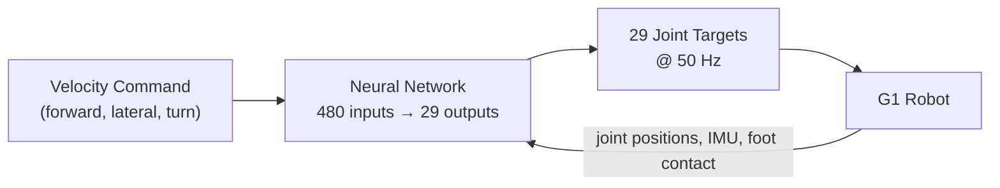
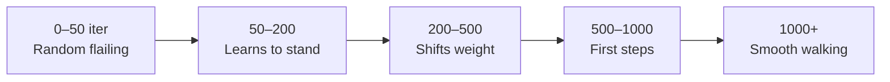

# G1 Locomotion: Training an RL Policy from Scratch

*2026-03-13*

I trained a locomotion policy for the Unitree G1 humanoid using reinforcement learning in NVIDIA Isaac Sim. The robot learned to walk entirely on its own, with no pre-programmed gaits and no motion capture data.

---

## Demo

<figure>
  <video controls autoplay muted loop style="width: 100%; border-radius: 8px;">
    <source src="/assets/g1-walking.mp4" type="video/mp4">
  </video>
  <figcaption>100 G1 robots walking in parallel using the trained policy. 4,096 were training simultaneously in the background.</figcaption>
</figure>

---

## Setup

| | |
|---|---|
| **Robot** | Unitree G1, 29 degrees of freedom |
| **Simulation** | NVIDIA Isaac Sim 5.1 + Isaac Lab 2.3.2 |
| **Hardware** | RTX 3090 (24 GB VRAM) |
| **Parallel environments** | 4,096 robots |
| **Training time** | ~4 hours |
| **Total timesteps** | 685 million |

---

## How Training Works

The policy is a neural network that maps sensor readings to joint commands. It starts with random weights and improves through trial and error over millions of attempts.

**Reward shaping** tells the robot what to optimize. Each timestep, the policy receives a score made up of several terms:

| Reward Term | Weight | What it encourages |
|-------------|--------|-------------------|
| Velocity tracking (linear) | 2.0 | Follow commanded forward/lateral speed |
| Velocity tracking (yaw) | 1.5 | Follow commanded turning rate |
| Foot clearance | 0.5 | Lift feet cleanly, no shuffling |
| Upright orientation | 1.0 | Stay balanced, do not tip |
| Smooth joint motion | 0.1 | Reduce jitter and energy waste |
| Alive bonus | 2.0 | Stay standing (penalized on fall) |

Higher weights make the robot prioritize those behaviors more. The alive bonus is critical early in training: it ensures the robot learns to stay upright before it tries to walk.

**Training phases:**

---

## Results

After 7,200 iterations (685 million timesteps):

| Metric | Value |
|--------|-------|
| Survival rate | **99.8%** |
| Velocity command accuracy | **90%** |
| Foot clearance score | **0.96 / 1.0** |
| Mean episode length | **996 / 1000 steps** |
| Mean reward | **+42.1** (from -0.87 at start) |

The reward improved from -0.87 (random flailing) to 42.1 (smooth, stable walking). The robot falls in less than 1 in 500 episodes.

---

## Reproducing This

For the full step-by-step guide including every command, config file, and file path, see the [RL Training Guide](../../simulation/unitree/rl-training-guide.md).

---

## Output

The trained policy is exported as an ONNX file, a portable inference format that runs on both the simulation workstation and the G1's onboard Jetson Orin. The same file validated in simulation can be deployed directly on the physical robot.
