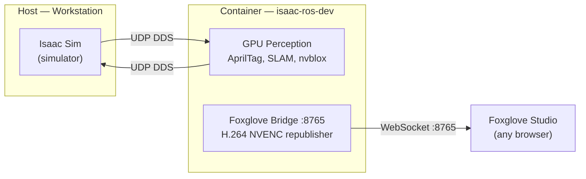

# Isaac ROS Container

GPU-accelerated ROS 2 perception container for simulation mode. Built from a Dockerfile on top of NVIDIA's base image.

## How It Works

The container is a self-contained ROS 2 environment with GPU access. It receives sensor data from Isaac Sim (running on the host) via DDS, runs GPU perception (SLAM, AprilTag, 3D mapping), and serves visualization over WebSocket.



The container uses `--network host` so it shares the host's network stack — DDS topics flow freely between Isaac Sim and the container without any port mapping.

---

## Quick Start

The container is managed entirely with docker-compose — no special CLI tools required.

```bash
# Start container
docker compose -f ~/workspaces/isaac_ros-dev/docker-compose.yml up -d

# Attach a shell
docker exec -it -u admin isaac_ros_dev_container bash

# Stop
docker compose -f ~/workspaces/isaac_ros-dev/docker-compose.yml down
```

**Tip:** Add an alias for quick shell access:

```bash
alias iros='docker exec -it -u admin isaac_ros_dev_container bash'
```

---

## What's in the Base Image

NVIDIA provides a ~38.8 GB base image from NGC:

```
nvcr.io/nvidia/isaac/ros:noble-ros2_jazzy_<hash>-amd64
```

This includes:

- **ROS 2 Jazzy** — full desktop install (50+ packages)
- **TensorRT** — GPU-accelerated inference
- **PyTorch** — deep learning framework
- **nav2** — ROS 2 navigation stack
- **rviz2** — 3D visualization
- **foxglove-bridge** — WebSocket bridge for Foxglove Studio
- **slam_toolbox** — SLAM algorithms
- **OpenCV** — computer vision (custom NVIDIA build with CUDA)
- **CUDA 13.0 dev tools** — compiler, libraries, headers
- **VPI, CV-CUDA, Triton** — NVIDIA perception and inference libraries

What's NOT in the base (we add these):

- Standard ROS 2 apt repository (NVIDIA base only has their own repos)
- Isaac ROS perception packages (apriltag, cuVSLAM, nvblox)
- H.264 NVENC video transport for Foxglove
- ffmpeg with NVENC support
- Teleop packages (keyboard and joystick control)
- FastDDS configuration for host/container communication

---

## What the Dockerfile Adds

The Dockerfile (`~/workspaces/isaac_ros-dev/Dockerfile`) adds a thin layer on top of the base. The base image is never modified — Docker layers are immutable.

### Packages

The NVIDIA base image only includes NVIDIA's own apt repos. The Dockerfile first adds the standard ROS 2 community repo (`packages.ros.org`) and removes a broken yarn repo from the base image, then installs packages from both sources:

| Package | Source | What it does |
|---|---|---|
| `ros-jazzy-isaac-ros-apriltag` | NVIDIA | GPU-accelerated AprilTag detection and pose estimation |
| `ros-jazzy-isaac-ros-visual-slam` | NVIDIA | cuVSLAM — visual SLAM using stereo cameras on GPU |
| `ros-jazzy-isaac-ros-nvblox` | NVIDIA | GPU 3D reconstruction from depth cameras |
| `ros-jazzy-foxglove-compressed-video-transport` | NVIDIA | Encodes camera feeds as H.264 for Foxglove |
| `ros-jazzy-ffmpeg-encoder-decoder` | NVIDIA | ROS 2 wrapper around ffmpeg for NVENC encoding |
| `ros-jazzy-teleop-twist-keyboard` | NVIDIA | Keyboard-based robot control — publishes `Twist` to `/cmd_vel` |
| `ros-jazzy-teleop-twist-joy` | ROS 2 | Converts `Joy` messages to `Twist` — for Foxglove joystick control |
| `ffmpeg` | Ubuntu | CLI video tool (used by the encoder) |

After installing, `rm -rf /var/lib/apt/lists/*` deletes the apt package index cache (~50-100 MB) to keep the image smaller. Standard Docker practice.

### FastDDS UDP-Only Transport

!!! bug "FastDDS SHM Transport Failure"

    **The problem:** ROS 2 uses DDS as its transport layer. On this system, Isaac Sim (host) uses FastDDS, which defaults to shared memory (SHM) when it detects two processes on the same machine. But Docker containers have isolated `/dev/shm` — even with `--ipc host`, FastDDS's SHM implementation fails to map memory across the host/container boundary. The result: `ros2 topic list` works (discovery uses UDP) but `ros2 topic echo` shows nothing (data transfer tries SHM and silently fails).

!!! success "Fix: Force UDP Transport"

    An XML config at `/etc/fastdds_no_shm.xml` disables SHM and forces all traffic over UDP. The environment variable `FASTRTPS_DEFAULT_PROFILES_FILE` tells FastDDS to load this config.

This env var is set in two places:

- `/etc/profile.d/fastdds-fix.sh` — picked up by login shells (when you `docker exec bash`)
- Explicitly in each entrypoint script — because the container's startup system sources scripts, not login shells, so profile.d doesn't apply

**Sim vs real:** This fix exists for simulation mode where Isaac Sim and the container share the same host. In real robot mode, the G1 uses CycloneDDS over Ethernet — a completely different DDS implementation on a different machine, so this config is irrelevant. However, forcing UDP is harmless in real mode too (UDP works fine over a network), so one image works for both scenarios without needing different configs.

### Entrypoint Scripts

The NVIDIA base image has a startup system: when the container boots, it runs every `.sh` script in `/usr/local/bin/scripts/entrypoint_additions/` in alphabetical order. The `50-` and `60-` prefixes control execution order.

| Script | What it does |
|---|---|
| `50-foxglove-bridge.sh` | Starts foxglove-bridge on port 8765 (WebSocket for Foxglove Studio) |
| `60-h264-republisher.sh` | Starts H.264 NVENC republisher (encodes raw camera topics for remote viewing) |
| `70-teleop-twist-joy.sh` | Starts `teleop_node` — converts `/joy` to `/cmd_vel` for Foxglove joystick control |

All scripts must explicitly set `FASTRTPS_DEFAULT_PROFILES_FILE` because entrypoint scripts are `source`d, not run as login shells.

### Admin User

A non-root `admin` user with passwordless sudo. Used when attaching to the container (`docker exec -it -u admin`).

---

## Running Services

### Foxglove Bridge

| | |
|---|---|
| **Port** | 8765 (WebSocket) |
| **Connect** | `ws://workstation:8765` or `ws://100.101.214.44:8765` (Tailscale) |
| **Auto-starts** | Yes, via entrypoint script |

Opens a WebSocket that Foxglove Studio connects to. Exposes all ROS 2 topics in real-time — camera feeds, SLAM maps, detections, joint states.

### H.264 NVENC Republisher

| | |
|---|---|
| **Subscribes to** | `/front_stereo_camera/left/image_rect_color` (raw) |
| **Publishes** | `/front_stereo_camera/left/compressed_video` (H.264) |
| **Auto-starts** | Yes, via entrypoint script |

Encodes raw camera images using the GPU's hardware H.264 encoder (NVENC). Without this, streaming raw images over the network to Foxglove is too slow.

!!! note
    H.265 does NOT work with Foxglove (browser can't decode keyframes). Use H.264 only.

### Teleop Twist Joy

| | |
|---|---|
| **Subscribes to** | `/joy` (`sensor_msgs/Joy`) |
| **Publishes** | `/cmd_vel` (`geometry_msgs/Twist`) |
| **Auto-starts** | Yes, via entrypoint script |

Converts joystick input to velocity commands. Axis 1 (vertical) maps to `linear.x` (forward/back), axis 0 (horizontal) maps to `angular.z` (turn). Deadman switch is disabled — input goes straight to `/cmd_vel`.

Used with the [foxglove-joystick](https://github.com/joshnewans/foxglove-joystick) extension in Foxglove Studio. Set the extension to **Keyboard mode** and publish to `/joy`.

---

## Files

All in `~/workspaces/isaac_ros-dev/`:

| File | Purpose |
|---|---|
| `Dockerfile` | Builds the image on top of NVIDIA base |
| `docker-compose.yml` | Launches the container with correct flags |
| `fastdds_no_shm.xml` | UDP-only DDS transport config |
| `50-foxglove-bridge.sh` | Foxglove auto-start entrypoint |
| `60-h264-republisher.sh` | H.264 republisher auto-start entrypoint |
| `70-teleop-twist-joy.sh` | Teleop Joy → Twist auto-start entrypoint |

### Rebuilding the Image

```bash
cd ~/workspaces/isaac_ros-dev
docker build -t isaac-ros-dev:latest .
```

The base image (38.8 GB) is cached — only the custom layer (~0.8 GB) rebuilds. Takes ~30 seconds.

---

## Host Wrapper

### `~/bin/ros2`

Runs `ros2` commands inside the container from the host terminal:

```bash
docker exec isaac_ros_dev_container bash -c \
  "export FASTRTPS_DEFAULT_PROFILES_FILE=/etc/fastdds_no_shm.xml && \
   source /opt/ros/jazzy/setup.bash && \
   ros2 $*"
```

---

## Teleop (Keyboard Control)

Drive the robot from a terminal using `teleop_twist_keyboard`. It publishes `geometry_msgs/Twist` to `/cmd_vel` and sends zero velocity when you release keys.

```bash
# In a tmux session
docker exec -it isaac_ros_dev_container bash -c \
  "source /opt/ros/jazzy/setup.bash && \
   export RMW_IMPLEMENTATION=rmw_fastrtps_cpp && \
   export FASTRTPS_DEFAULT_PROFILES_FILE=/etc/fastdds_no_shm.xml && \
   ros2 run teleop_twist_keyboard teleop_twist_keyboard"
```

Controls:

```
   u    i    o        i = forward       k = stop
   j    k    l        , = backward      q/z = speed up/down
   m    ,    .        j/l = turn        w/x = turn speed up/down
```

---

## What's NOT in the Container

| Not included | Why |
|---|---|
| Unitree SDK / unitree_ros2 | Runs on the G1's Jetson Orin, not the workstation |
| System ROS 2 on host | Conflicts with Isaac Sim's bundled Python 3.11 rclpy |
| CycloneDDS config | Only needed for real robot mode (Orin handles this) |

---

## Why Not isaac-ros-cli?

NVIDIA ships an apt package called `isaac-ros-cli` that provides `isaac-ros activate` and `isaac-ros init` commands for managing Isaac ROS containers. It was removed from this system (`sudo apt remove isaac-ros-cli`) and is not needed. Docker-compose replaces it entirely.

Problems with `isaac-ros-cli`:

- **Raw `docker run`** — it launches containers with `docker run` rather than compose, so there's no declarative config to version-control or reproduce.
- **Undocumented image key system** — it layers customizations using an internal "image key" mechanism that isn't well documented. Understanding what ends up in the final image requires reading the CLI's source.
- **Destroys customizations** — running `isaac-ros activate` without specifying the correct custom keys recreates the container from the stock NVIDIA base image, silently losing any packages or configs you added.
- **Redundant configs** — it ships its own Dockerfiles and FastDDS configs in `/etc/isaac-ros-cli/`, duplicating what's already managed in `~/workspaces/isaac_ros-dev/`.

The docker-compose approach at `~/workspaces/isaac_ros-dev/` gives full control over the image, explicit configuration in version-controlled files, and predictable `up`/`down` lifecycle management.

---

## Troubleshooting

??? bug "Topics visible but no data flowing"

    FastDDS SHM issue. Check that the XML config exists and the env var is set:

    ```bash
    docker exec isaac_ros_dev_container bash -c \
      "cat /etc/fastdds_no_shm.xml && echo '---' && echo \$FASTRTPS_DEFAULT_PROFILES_FILE"
    ```

    If missing, the Dockerfile needs rebuilding — the config is baked into the image.

??? bug "Foxglove says \"Check that WebSocket server is reachable\""

    foxglove-bridge isn't running. Check and restart:

    ```bash
    docker exec isaac_ros_dev_container bash -c \
      "export FASTRTPS_DEFAULT_PROFILES_FILE=/etc/fastdds_no_shm.xml && \
       source /opt/ros/jazzy/setup.bash && \
       ros2 launch foxglove_bridge foxglove_bridge_launch.xml port:=8765 &"
    ```

??? bug "Container missing packages after restart"

    This happens when a container is recreated from the stock NVIDIA base image instead of the custom `isaac-ros-dev:latest` image. A common cause was `isaac-ros activate` (from the `isaac-ros-cli` package), which silently recreates containers from base without custom layers. That tool has been removed — see [Why Not isaac-ros-cli?](#why-not-isaac-ros-cli) above. Always use `docker compose up -d` to manage the container.

??? bug "Camera feed flickering between two views in Foxglove"

    If the video stream appears to alternate between two slightly offset perspectives (like flipping between left and right stereo cameras), check for multiple Isaac Sim instances publishing to the same ROS 2 topics:

    ```bash
    ps aux | grep isaacsim
    ```

    Two instances will interleave frames on the same topic, causing the flickering. Kill the extra instance and leave only one running. This commonly happens when a headless instance was left running in a tmux session and a second GUI instance was launched separately.
