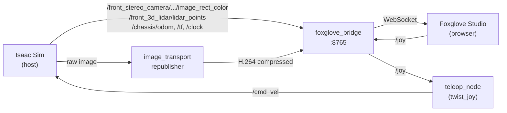

# ROS Nodes

ROS 2 nodes running in the Isaac ROS container and their data flow.

## Node Overview



---

## Auto-Start Nodes

These nodes start automatically when the container boots, via entrypoint scripts.

### foxglove_bridge

WebSocket bridge that exposes all ROS 2 topics to Foxglove Studio.

| | |
|---|---|
| **Entrypoint** | `50-foxglove-bridge.sh` |
| **Port** | 8765 |
| **Connect** | `ws://workstation:8765` or `ws://100.101.214.44:8765` |

Foxglove Studio connects to this bridge and can subscribe to any ROS 2 topic, publish messages (like `/joy` from the joystick panel), and call services. It's the single point of contact between the browser and the ROS 2 system.

### image_transport republisher

Encodes raw camera images to H.264 using the GPU's hardware encoder (NVENC).

| | |
|---|---|
| **Entrypoint** | `60-h264-republisher.sh` |
| **Subscribes to** | `/front_stereo_camera/left/image_rect_color` (raw, ~2.7 MB/frame) |
| **Publishes** | `/front_stereo_camera/left/compressed_video` (H.264, ~50 KB/frame) |

Without this, streaming raw camera images over the network to Foxglove is too slow. The NVENC encoder runs on dedicated GPU silicon and doesn't affect simulation performance.

!!! note
    H.265 does NOT work with Foxglove (browser can't decode keyframes). Use H.264 only.

### teleop_node (teleop_twist_joy)

Converts joystick input to robot velocity commands.

| | |
|---|---|
| **Entrypoint** | `70-teleop-twist-joy.sh` |
| **Subscribes to** | `/joy` (`sensor_msgs/Joy`) |
| **Publishes** | `/cmd_vel` (`geometry_msgs/Twist`) |

Axis mapping:

| Joy axis | Twist field | Control |
|---|---|---|
| Axis 0 (horizontal) | `angular.z` | Turn left/right (0.5 rad/s max) |
| Axis 1 (vertical) | `linear.x` | Forward/backward (0.5 m/s max) |

The deadman switch is disabled (`require_enable_button:=false`) so input goes straight to `/cmd_vel`. Used with the [foxglove-joystick](https://github.com/joshnewans/foxglove-joystick) extension in Foxglove (set to **Keyboard mode**, publishing to `/joy`).

---

## On-Demand Nodes

These are installed but not auto-started. Run them manually as needed.

### teleop_twist_keyboard

Keyboard-based robot control from a terminal. Publishes `Twist` directly to `/cmd_vel` — no Joy conversion needed.

```bash
# In a tmux session
docker exec -it isaac_ros_dev_container bash -c \
  "source /opt/ros/jazzy/setup.bash && \
   export RMW_IMPLEMENTATION=rmw_fastrtps_cpp && \
   export FASTRTPS_DEFAULT_PROFILES_FILE=/etc/fastdds_no_shm.xml && \
   ros2 run teleop_twist_keyboard teleop_twist_keyboard"
```

```
   u    i    o        i = forward       k = stop
   j    k    l        , = backward      q/z = speed up/down
   m    ,    .        j/l = turn        w/x = turn speed up/down
```

### isaac_ros_visual_slam (cuVSLAM)

GPU-accelerated visual SLAM using stereo cameras. Estimates the robot's pose and builds a map of visual landmarks.

```bash
docker exec -it isaac_ros_dev_container bash -c \
  "source /opt/ros/jazzy/setup.bash && \
   export RMW_IMPLEMENTATION=rmw_fastrtps_cpp && \
   export FASTRTPS_DEFAULT_PROFILES_FILE=/etc/fastdds_no_shm.xml && \
   ros2 launch isaac_ros_visual_slam isaac_ros_visual_slam_isaac_sim.launch.py"
```

| | |
|---|---|
| **Subscribes to** | `/front_stereo_camera/left/image_rect_color`, `/right/image_rect_color`, and their `camera_info` topics |
| **Publishes** | `/visual_slam/tracking/odometry`, `/visual_slam/vis/landmarks_cloud` |

### isaac_ros_apriltag

GPU-accelerated AprilTag detection and 6DOF pose estimation.

```bash
docker exec -it isaac_ros_dev_container bash -c \
  "source /opt/ros/jazzy/setup.bash && \
   export RMW_IMPLEMENTATION=rmw_fastrtps_cpp && \
   export FASTRTPS_DEFAULT_PROFILES_FILE=/etc/fastdds_no_shm.xml && \
   ros2 launch isaac_ros_apriltag isaac_ros_apriltag_isaac_sim_pipeline.launch.py"
```

| | |
|---|---|
| **Subscribes to** | `/front_stereo_camera/left/image_rect_color`, `/front_stereo_camera/left/camera_info` |
| **Publishes** | `/tag_detections` (`isaac_ros_apriltag_interfaces/AprilTagDetectionArray`) |

---

## Checking Running Nodes

```bash
# List all active nodes
ros2 node list

# See what a node subscribes to and publishes
ros2 node info /foxglove_bridge

# Check a specific topic's publishers and subscribers
ros2 topic info /cmd_vel --verbose
```
