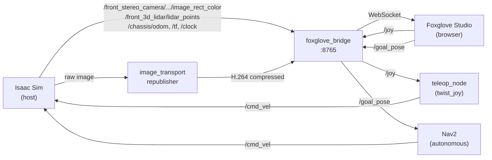

# ROS Nodes

ROS 2 nodes running in the Isaac ROS container and their data flow.

## Node Overview



---

## Auto-Start Nodes

These nodes start automatically when the container boots, via entrypoint scripts.

<div class="grid cards" markdown>

-   :material-bridge:{ .lg .middle } **[Foxglove Bridge](foxglove-bridge.md)**

    ---

    WebSocket bridge exposing all ROS 2 topics to Foxglove Studio

-   :material-video:{ .lg .middle } **[H.264 Republisher](h264-republisher.md)**

    ---

    GPU-accelerated H.264 encoding for camera streams (NVENC)

-   :material-gamepad-variant:{ .lg .middle } **[Teleop Twist Joy](teleop-twist-joy.md)**

    ---

    Joystick input → robot velocity commands via Foxglove

</div>

---

## On-Demand Nodes

Installed but not auto-started. Run manually as needed.

<div class="grid cards" markdown>

-   :material-keyboard:{ .lg .middle } **[Teleop Keyboard](teleop-keyboard.md)**

    ---

    Terminal-based keyboard control for `/cmd_vel`

-   :material-eye:{ .lg .middle } **[cuVSLAM](cuvslam.md)**

    ---

    GPU-accelerated visual SLAM — stereo odometry and landmark mapping

-   :material-tag:{ .lg .middle } **[AprilTag](apriltag.md)**

    ---

    GPU-accelerated AprilTag detection and 6DOF pose estimation

-   :material-navigation:{ .lg .middle } **[Nav2](nav2.md)**

    ---

    Autonomous navigation — path planning, obstacle avoidance, goal tracking

</div>

---

## Checking Running Nodes

```bash
# List all active nodes
ros2 node list

# See what a node subscribes to and publishes
ros2 node info /foxglove_bridge

# Check a specific topic's publishers and subscribers
ros2 topic info /cmd_vel --verbose
```
