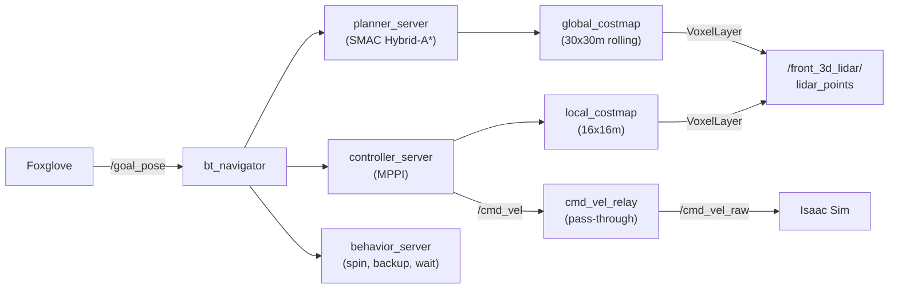
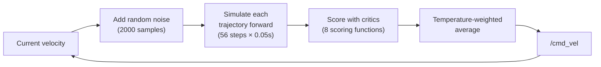

# Nav2 (Autonomous Navigation)

Autonomous navigation using Nav2 — path planning, obstacle avoidance, and goal tracking. Uses 3D lidar for costmaps and a static identity `map -> odom` transform for localization (no static map or AMCL needed).

| | |
|---|---|
| **Launch script** | `launch_nav2.sh` -> `nav2_carter_launch.py` |
| **Config file** | `nav2_carter_params.yaml` |
| **Behavior tree** | `nav2_bt_carter.xml` (replans every 5s instead of default 1s) |
| **Subscribes to** | `/front_3d_lidar/lidar_points` (costmaps), `/chassis/odom`, TF chain |
| **Publishes** | `/cmd_vel`, `/plan`, `/global_costmap/costmap`, `/local_costmap/costmap` |
| **Requires** | `map -> odom -> base_link` TF chain (see [TF Setup](#tf-setup)), `cmd_vel_relay.py` for OmniGraph topic remap |

## Architecture



### How the stack fits together

Costmaps
:   VoxelLayer converts 3D lidar point clouds into obstacle grids. No static map is needed; the costmaps build up from live sensor data as the robot moves. Points below 1.0m are filtered to ignore ground bumps. `track_unknown_space: false` on the global costmap so unscanned cells default to "free" rather than "unknown" (which blocks the planner).

Localization
:   Nav2 needs to know where the robot is in the world. In ROS 2, position is expressed as a chain of coordinate frame transforms (TF): `map -> odom -> base_link`. Each link answers a question:

    - **`map -> odom`**: Where is the odometry origin in the world? On a real robot, a SLAM or localization system (like AMCL) continuously corrects this to account for odometry drift. Here, we use a **static identity transform** — it just says "the odom frame *is* the map frame, with no offset." This works because we don't need global localization (no pre-built map to localize against), and it means the robot's position in the map is whatever odometry says it is.
    - **`odom -> base_link`**: Where is the robot relative to where it started? Isaac Sim publishes this as a topic (`/chassis/odom`) but not as a TF broadcast, so `odom_tf_bridge.py` converts the topic into a TF frame.
    - **`base_link -> sensors`**: Where are the sensors on the robot? Isaac Sim publishes these automatically.

    The net effect: the robot thinks its starting position is the map origin, and all positions are relative to that. This is fine for local navigation (drive to goals within the current area) but doesn't support re-localizing on a saved map. cuVSLAM can optionally replace the static `map -> odom` with a visual-odometry-corrected transform, but it tends to drift over long runs.

Planning
:   SMAC Hybrid-A* planner with `allow_unknown: true` so it can plan through unexplored areas. The global costmap is a 30x30m rolling window centered on the robot. The custom behavior tree replans every 5 seconds (default is 1s) to give the robot time to accelerate and commit to a path.

Control
:   MPPI controller generates smooth velocity commands toward the planned path. Configured for up to 2.0 m/s, though actual cruise speed is ~0.3 m/s in simulation due to 0.5x real-time factor (see [MPPI Speed Tuning](#mppi-speed-tuning)). Carter footprint is used for collision checking. `SimpleGoalChecker` with 0.5m tolerance so the robot actually stops at the goal.

cmd_vel relay
:   Isaac Sim's differential drive OmniGraph node is remapped to subscribe to `/cmd_vel_raw` instead of `/cmd_vel` (via `headless-sample-scene.sh`). The `cmd_vel_relay.py` node bridges Nav2/teleop output on `/cmd_vel` to `/cmd_vel_raw`. This is a simple pass-through with no sign changes — `base_link` +X = physical forward.

---

## TF Setup

Nav2 requires a complete `map -> odom -> base_link` TF chain. Isaac Sim publishes `base_link -> sensor_frames` but does **not** publish `odom -> base_link`. Two helper processes provide the missing transforms:

```bash
# 1. odom->base_link TF bridge (converts /chassis/odom topic to TF)
docker exec -d isaac_ros_dev_container bash -c '
  export FASTRTPS_DEFAULT_PROFILES_FILE=/etc/fastdds_no_shm.xml
  export RMW_IMPLEMENTATION=rmw_fastrtps_cpp
  source /opt/ros/jazzy/setup.bash
  python3 /workspaces/isaac_ros-dev/odom_tf_bridge.py'

# 2. Static map->odom identity (use_sim_time required!)
docker exec -d isaac_ros_dev_container bash -c '
  export FASTRTPS_DEFAULT_PROFILES_FILE=/etc/fastdds_no_shm.xml
  export RMW_IMPLEMENTATION=rmw_fastrtps_cpp
  source /opt/ros/jazzy/setup.bash
  ros2 run tf2_ros static_transform_publisher 0 0 0 0 0 0 map odom \
    --ros-args -p use_sim_time:=true'
```

!!! warning "Sim time for static TF"
    The `static_transform_publisher` **must** use `use_sim_time:=true`. Without it, the TF timestamps are wall-clock time (~1.77 billion seconds) while Nav2 expects sim time (~6000 seconds), causing all TF lookups to fail silently.

Alternatively, cuVSLAM can provide the `map -> odom` transform, but it may drift significantly over time.

---

## Launching

### Auto-start (default)

All helper processes and Nav2 auto-start with the container via scripts in `/usr/local/bin/scripts/entrypoint_additions/`:

| Script | Process |
|---|---|
| `75-odom-tf-bridge.sh` | odom -> base_link TF bridge |
| `76-static-map-odom.sh` | Static map -> odom identity TF |
| `77-cmd-vel-relay.sh` | cmd_vel relay (pass-through /cmd_vel -> /cmd_vel_raw) |
| `80-nav2.sh` | Full Nav2 stack |

!!! info "Teleop coexists with Nav2"
    Teleop (`70-teleop-twist-joy.sh`) publishes to `/cmd_vel`, the same topic as Nav2. The Foxglove joystick only publishes when touched (no zero-flooding), so it naturally overrides Nav2 during use and stops when released. Both can run simultaneously.

### Manual launch

If auto-start is disabled, launch all helpers and Nav2 by hand:

```bash
# 1. Start TF helpers (see above)
# 2. Start cmd_vel relay (pass-through /cmd_vel -> /cmd_vel_raw)
docker exec -d isaac_ros_dev_container bash /workspaces/isaac_ros-dev/77-cmd-vel-relay.sh
# 3. Start Nav2
docker exec -it isaac_ros_dev_container bash /workspaces/isaac_ros-dev/launch_nav2.sh
```

Wait for "Managed nodes are active" in the output — the SMAC planner takes ~15 seconds to build its lookup table, so full startup is around 30-40 seconds.

!!! note "Custom launch file"
    Nav2 1.3.9's stock `navigation_launch.py` requires `nav2_route` which isn't in the container's apt repos. `nav2_carter_launch.py` is a custom launch file that skips `route_server`, `collision_monitor`, and `docking_server`.

---

## Sending Goals

### From Foxglove

The 3D panel's built-in "Publish Pose" uses `foxglove.PoseInFrame` schema, which the bridge doesn't convert to ROS. Use a **Publish panel** instead:

1. **Add panel** -> **Publish**
2. Set **Topic** to `/goal_pose`
3. Set **Schema** to `geometry_msgs/msg/PoseStamped`
4. Publish a message like:

```json
{
  "header": {"frame_id": "map"},
  "pose": {
    "position": {"x": 3.0, "y": 0.0, "z": 0.0},
    "orientation": {"w": 1.0}
  }
}
```

### From the command line

```bash
ros2 topic pub /goal_pose geometry_msgs/msg/PoseStamped \
  '{header: {frame_id: "map"}, pose: {position: {x: 3.0, y: 0.0}, orientation: {w: 1.0}}}' --once
```

---

## Visualization in Foxglove

### Costmap overlay

Add these topics to the Foxglove 3D panel to see obstacle detection:

- `/local_costmap/costmap` — 16x16m area around the robot
- `/global_costmap/costmap` — 30x30m rolling window
- `/plan` — planned path to the goal

### Position tracking

Add a **Plot** panel with two series to see XY coordinates over time:

- `/chassis/odom.pose.pose.position.x`
- `/chassis/odom.pose.pose.position.y`

---

## Teleop Override

Both `teleop_twist_joy_node` and Nav2 publish to `/cmd_vel`. The Foxglove joystick extension only publishes `/joy` messages when the stick is actively touched — it does **not** flood zeros when idle. This means Nav2 commands pass through uninterrupted when the joystick is released, and joystick input naturally overrides Nav2 when you grab the stick.

!!! tip "No need to kill teleop"
    Unlike `teleop_twist_keyboard` (which floods zeros), the joystick teleop coexists with Nav2. Both auto-start with the container.

---

## MPPI Speed Tuning

Out of the box, MPPI defaults produce very slow movement (~0.05 m/s) despite a 2.0 m/s max velocity setting. This section explains how MPPI works, what each tuning knob does, and the specific bottlenecks discovered through iterative testing on the Carter robot.

### How MPPI works

MPPI (Model Predictive Path Integral) is a sampling-based controller. Instead of computing a single optimal path, it tries thousands of random possibilities and picks the best one. Every control cycle it:

1. **Samples** a batch of random trajectories (default 2000) by adding noise to the current velocity
2. **Scores** each trajectory using a set of "critics" — scoring functions that penalize things like straying from the path, getting too close to obstacles, or going the wrong direction
3. **Selects** the best trajectory using a temperature-weighted average — lower scores are better, and the `temperature` parameter controls how aggressively it favors the best-scoring trajectories



The prediction horizon — how far into the future each trajectory looks — is `time_steps × model_dt`. With 56 steps at 0.05s each, that's **2.8 seconds ahead**. At the max speed of 2.0 m/s, that covers 5.6 meters of path.

### Understanding the critics

Each critic assigns a penalty score to a trajectory. Some critics evaluate **every step** of the trajectory (56 penalties added up), while others only look at the **endpoint** (one penalty). This distinction matters for speed — per-step critics accumulate higher penalties on faster trajectories simply because the robot covers more ground, even if the trajectory is perfectly safe.

| Critic | What it does | Evaluation | Speed impact |
|---|---|---|---|
| `ConstraintCritic` | Rejects trajectories exceeding velocity/acceleration limits | Per-step | Neutral (hard constraint) |
| `CostCritic` | Penalizes trajectories passing through costmap obstacles | Per-step | **Slows** — faster = more cells traversed = higher accumulated cost |
| `GoalCritic` | Rewards getting closer to the goal position | Endpoint | Neutral |
| `GoalAngleCritic` | Rewards facing the goal at close range | Endpoint | Neutral |
| `PathAlignCritic` | Penalizes deviation from the planned path | Per-step (mean-normalized) | **Neutral** — uses mean normalization, not sum |
| `PathFollowCritic` | Rewards reaching further along the path | Endpoint | **Speeds up** — the main forward-driving force |
| `PathAngleCritic` | Penalizes heading away from the path direction | Per-step (early-exit) | Minimal — exits early once heading is aligned |
| `PreferForwardCritic` | Penalizes reverse motion | Per-step | Minimal at low weight |

`PathFollowCritic` is the most important critic for speed. It only looks at the furthest point reached along the path — faster trajectories reach further and score better. Its `cost_weight` of 50.0 is intentionally high to dominate the per-step critics that slow things down.

### Key speed bottlenecks

These are the specific issues discovered through iterative tuning, in order of impact:

#### 1. temperature (the #1 bottleneck)

`temperature` controls how selective the weighted average is when combining the 2000 sampled trajectories. A low temperature exponentially down-weights any trajectory that costs even slightly more than the current best.

The problem: at `temperature: 0.1`, once the optimizer converges on ~0.4 m/s, it can't escape. Any faster trajectory incurs slightly higher per-step critic costs, so it gets exponentially suppressed in the weighted average. The optimizer is trapped in a local speed minimum.

| Value | Behavior |
|---|---|
| 0.1 | Too greedy — trapped at ~0.4 m/s, can't explore faster solutions |
| **0.3** | **Default — allows proper exploration while still favoring good trajectories** |
| 1.0+ | Too permissive — erratic, includes many bad trajectories in the average |

#### 2. Costmap, prune distance, and horizon consistency

Three settings must be mathematically consistent or the controller physically cannot command high speeds:

```
prediction_horizon = time_steps × model_dt = 56 × 0.05 = 2.8 seconds
max_projection     = vx_max × horizon      = 2.0 × 2.8  = 5.6 meters
```

- **`prune_distance`** must be >= max_projection (5.6m). If the controller only sees 3.5m of path, it can't plan trajectories that go further. Set to **8.0m** for margin.
- **Local costmap** must be >= 2 × max_projection (11.2m). Trajectories that leave the costmap boundary get rejected. Set to **16×16m**.
- **`PathFollowCritic.cost_weight`** must be high enough (50.0) to make reaching further along the path the dominant objective.

#### 3. vx_std (velocity sampling noise)

`vx_std` controls how much random noise is added to the current velocity when generating sample trajectories. It must scale with `vx_max`:

| Value | With vx_max=2.0 | Result |
|---|---|---|
| 0.2 | 95% of samples within ±0.4 m/s of current speed | Too narrow — takes many cycles to explore faster |
| **0.5** | **95% of samples within ±1.0 m/s** | **Good balance of exploration and stability** |
| 0.8 | 95% of samples within ±1.6 m/s | Too wide — some samples go fast-forward, others fast-backward, and the weighted average cancels them to near-zero |

#### 4. Compute budget (batch_size × iteration_count)

MPPI must finish computing within one control cycle. At 0.5× real-time factor, CPU time is already stretched:

| Setting | Control rate | Result |
|---|---|---|
| batch_size=3000, iteration_count=2 | ~12 Hz | Erratic — can't keep up, oscillating commands |
| **batch_size=2000, iteration_count=1** | **~15-20 Hz** | **Stable — smooth trajectory tracking** |

#### 5. model_dt vs controller_frequency

MPPI checks at startup that `model_dt >= 1/controller_frequency`. If the controller runs faster than the simulation timestep, predictions are invalid.

| controller_frequency | Period | model_dt | Result |
|---|---|---|---|
| 10 Hz | 0.1s | 0.05s | **FATAL** — period (0.1s) > model_dt (0.05s), Nav2 refuses to start |
| 20 Hz | 0.05s | 0.05s | Passes check (equal). Actually runs at ~15 Hz due to 0.5× RTF |

!!! warning "model_dt startup constraint"
    `model_dt` must be >= `1/controller_frequency` or MPPI crashes on startup with: "Controller period more than model dt, set it equal to model dt." This is a hard check — there's no workaround.

### Obstacle avoidance tuning

Per-step critics like `CostCritic` accumulate higher penalties on faster trajectories because the robot passes through more costmap cells. Two settings reduce this effect:

| Parameter | Value | Why |
|---|---|---|
| `CostCritic.cost_weight` | 0.5 | Low weight so obstacle cost doesn't dominate PathFollowCritic (50.0) |
| `CostCritic.trajectory_point_step` | 4 | Evaluate every 4th step instead of every step — reduces accumulation by 75% |
| `inflation_radius` (local) | 0.75 | Must be >= circumscribed radius (0.696m) for the planner |
| `cost_scaling_factor` (local) | 10.0 | Steep falloff — costs drop to near-zero by ~0.5m from obstacle edges, so the robot isn't "always in cost-space" in narrow aisles |

### Results

With these settings the robot navigates to goals at **~0.4 m/s peak commanded**, **~0.3 m/s peak odom**, with a cruise speed of **~0.15-0.20 m/s**. The simulation runs at 0.5× real-time on an RTX 3090 with headless rendering.

!!! info "Why not faster?"
    The main remaining bottleneck is the **WallRate sim-time mismatch**. Nav2's controller uses wall-clock time for its loop rate, but the sim runs at 0.5× real-time. A 20 Hz controller effectively runs at ~10 Hz in sim-time, causing prediction horizon mismatches. This is a [known Nav2 issue](https://github.com/ros-navigation/navigation2/issues/3303) with no fix available — the controller would need a SimRate option.

!!! tip "Dynamic parameter tuning"
    Most MPPI parameters can be changed at runtime without restarting Nav2:

    ```bash
    ros2 param set /controller_server FollowPath.PathFollowCritic.cost_weight 25.0
    ```

    **Exception:** `time_steps` and `model_dt` are allocated at init time. Changing them dynamically corrupts internal buffers — always change via YAML and restart.

---

## Config Files

All files are in `~/workspaces/isaac_ros-dev/`:

| File | Purpose |
|---|---|
| `nav2_carter_params.yaml` | Nav2 node parameters (costmaps, planner, controller, speeds) |
| `nav2_carter_launch.py` | Custom launch file (skips missing `nav2_route` package) |
| `nav2_bt_carter.xml` | Behavior tree — replan rate, recovery behaviors |
| `launch_nav2.sh` | Shell wrapper with FastDDS and RMW env vars |
| `odom_tf_bridge.py` | Converts `/chassis/odom` to `odom -> base_link` TF broadcast |
| `cmd_vel_relay.py` | Pass-through relay `/cmd_vel` -> `/cmd_vel_raw` (for OmniGraph remap) |

Auto-start entrypoint scripts (in `/usr/local/bin/scripts/entrypoint_additions/`):

| File | Purpose |
|---|---|
| `75-odom-tf-bridge.sh` | Odom TF bridge on container boot |
| `76-static-map-odom.sh` | Static map->odom TF on container boot |
| `77-cmd-vel-relay.sh` | cmd_vel relay on container boot |
| `80-nav2.sh` | Nav2 stack on container boot |

---

## Troubleshooting

### TF and localization

**"Timed out waiting for transform"**
:   The TF chain is incomplete. Verify all three links exist: `map -> odom` (static publisher or cuVSLAM), `odom -> base_link` (odom_tf_bridge.py), `base_link -> sensors` (Isaac Sim). `transform_tolerance` is set to 0.5s.

**Point cloud rotated/drifted**
:   cuVSLAM has lost tracking accuracy (often after a collision). Restart cuVSLAM to reset:

    ```bash
    docker exec isaac_ros_dev_container bash -c "pkill -f visual_slam"
    ```

    Then relaunch cuVSLAM.

### Planning and goals

**Planner fails to find path**
:   The goal may be outside the costmap (60m rolling window), or in unknown space. With `track_unknown_space: false`, the costmap defaults to free, so this should be rare. Check the goal is within range with `ros2 run tf2_ros tf2_echo map base_link`.

**Robot doesn't stop at goal**
:   The config uses `SimpleGoalChecker` with 0.5m/0.5rad tolerance. If using `StoppedGoalChecker` instead, the robot may never satisfy the "fully stopped" condition and loop forever.

### Movement issues

**"Sensor origin is out of map bounds"**
:   Harmless warning. The lidar mount (~2m) is above the costmap's `max_obstacle_height` (1.9m). The costmap still works.

### Process management

**Duplicate node errors on relaunch**
:   Old Nav2 processes linger after `pkill`. Wait ~30 seconds for DDS discovery to clean up stale entries before relaunching. Check with `ros2 node list`.

!!! warning "Stopping Nav2"
    Killing a tmux session running `docker exec` does **not** kill the processes inside the container. Always stop from inside:

    ```bash
    docker exec isaac_ros_dev_container bash -c \
      "pkill -9 -f controller_server; pkill -9 -f smoother_server; \
       pkill -9 -f planner_server; pkill -9 -f behavior_server; \
       pkill -9 -f bt_navigator; pkill -9 -f velocity_smoother; \
       pkill -9 -f waypoint_follower; pkill -9 -f lifecycle_manager; \
       pkill -9 -f nav2_carter_launch; pkill -9 -f launch_nav2"
    ```

    Then wait ~30 seconds before relaunching so DDS clears the stale node registrations.

!!! note "Plugin naming in Jazzy"
    Nav2 Jazzy requires `::` separator for plugin names (e.g., `nav2_smac_planner::SmacPlannerHybrid`). The older `/` format (e.g., `nav2_smac_planner/SmacPlannerHybrid`) causes "class does not exist" errors. Also, `plugin_lib_names` should NOT be listed in `bt_navigator` config — built-in plugins are registered automatically.
