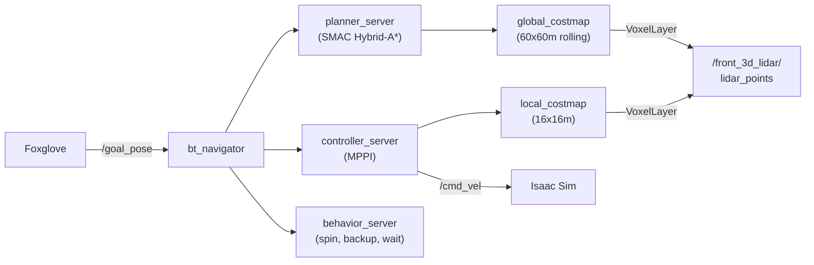

# Nav2 (Autonomous Navigation)

Autonomous navigation using Nav2 — path planning, obstacle avoidance, and goal tracking. Uses 3D lidar for costmaps and a static identity `map → odom` transform for localization (no static map or AMCL needed).

## Architecture



| | |
|---|---|
| **Launch script** | `launch_nav2.sh` → `nav2_carter_launch.py` |
| **Config file** | `nav2_carter_params.yaml` |
| **Behavior tree** | `nav2_bt_carter.xml` (replans every 5s instead of default 1s) |
| **Subscribes to** | `/front_3d_lidar/lidar_points` (costmaps), `/chassis/odom`, TF chain |
| **Publishes** | `/cmd_vel`, `/plan`, `/global_costmap/costmap`, `/local_costmap/costmap` |
| **Requires** | `map → odom → base_link` TF chain (see [TF Setup](#tf-setup) below) |

## TF Setup

Nav2 requires a complete `map → odom → base_link` TF chain. Isaac Sim publishes `base_link → sensor_frames` but does **not** publish `odom → base_link`. Two helper processes are needed:

```bash
# 1. odom→base_link TF bridge (converts /chassis/odom topic to TF)
docker exec -d isaac_ros_dev_container bash -c '
  export FASTRTPS_DEFAULT_PROFILES_FILE=/etc/fastdds_no_shm.xml
  export RMW_IMPLEMENTATION=rmw_fastrtps_cpp
  source /opt/ros/jazzy/setup.bash
  python3 /workspaces/isaac_ros-dev/odom_tf_bridge.py'

# 2. Static map→odom identity (use_sim_time required!)
docker exec -d isaac_ros_dev_container bash -c '
  export FASTRTPS_DEFAULT_PROFILES_FILE=/etc/fastdds_no_shm.xml
  export RMW_IMPLEMENTATION=rmw_fastrtps_cpp
  source /opt/ros/jazzy/setup.bash
  ros2 run tf2_ros static_transform_publisher 0 0 0 0 0 0 map odom \
    --ros-args -p use_sim_time:=true'
```

!!! warning "Sim time for static TF"
    The `static_transform_publisher` **must** use `use_sim_time:=true`. Without it, the TF timestamps are wall-clock time (~1.77 billion seconds) while Nav2 expects sim time (~6000 seconds), causing all TF lookups to fail silently.

Alternatively, cuVSLAM can provide the `map → odom` transform, but it may drift significantly over time.

## Launching

All three helper processes (odom TF bridge, static map→odom, Nav2) auto-start with the container via scripts in `/usr/local/bin/scripts/entrypoint_additions/`:

| Script | Process |
|---|---|
| `75-odom-tf-bridge.sh` | odom → base_link TF bridge |
| `76-static-map-odom.sh` | Static map → odom identity TF |
| `80-nav2.sh` | Full Nav2 stack |

Teleop (`70-teleop-twist-joy.sh`) is **removed** from auto-start because it floods `/cmd_vel` with zeros, overriding Nav2. To use joystick control, run it manually and kill Nav2 first.

To manually launch Nav2 (if auto-start is disabled):

```bash
# 1. Start TF helpers (see above)
# 2. Kill teleop (it floods /cmd_vel with zeros)
docker exec isaac_ros_dev_container bash -c "pkill -f teleop_twist_joy"
# 3. Start Nav2
docker exec -it isaac_ros_dev_container bash /workspaces/isaac_ros-dev/launch_nav2.sh
```

Wait for "Managed nodes are active" in the output — the SMAC planner takes ~15 seconds to build its lookup table, so full startup is around 30-40 seconds.

!!! note "Custom launch file"
    Nav2 1.3.9's stock `navigation_launch.py` requires `nav2_route` which isn't in the container's apt repos. `nav2_carter_launch.py` is a custom launch file that skips `route_server`, `collision_monitor`, and `docking_server`.

## Sending Goals from Foxglove

The 3D panel's built-in "Publish Pose" uses `foxglove.PoseInFrame` schema, which the bridge doesn't convert to ROS. Use a **Publish panel** instead:

1. **Add panel** → **Publish**
2. Set **Topic** to `/goal_pose`
3. Set **Schema** to `geometry_msgs/msg/PoseStamped`
4. Publish a message like:

```json
{
  "header": {"frame_id": "map"},
  "pose": {
    "position": {"x": 3.0, "y": 0.0, "z": 0.0},
    "orientation": {"w": 1.0}
  }
}
```

Or from the command line:

```bash
ros2 topic pub /goal_pose geometry_msgs/msg/PoseStamped \
  '{header: {frame_id: "map"}, pose: {position: {x: 3.0, y: 0.0}, orientation: {w: 1.0}}}' --once
```

## Costmap Visualization

Add these topics to the Foxglove 3D panel to see obstacle detection:

- `/local_costmap/costmap` — 16x16m area around the robot
- `/global_costmap/costmap` — 60x60m rolling window
- `/plan` — planned path to the goal

## Position Tracking

Add a **Plot** panel with two series to see XY coordinates over time:

- `/chassis/odom.pose.pose.position.x`
- `/chassis/odom.pose.pose.position.y`

## Teleop Conflict

Both `teleop_twist_joy_node` and Nav2 publish to `/cmd_vel`. The teleop node continuously publishes zeros when no joystick button is pressed, which overrides Nav2's velocity commands and makes the robot barely move.

**Fix:** Kill teleop before starting autonomous navigation:

```bash
docker exec isaac_ros_dev_container bash -c "pkill -f teleop_twist_joy"
```

To re-enable joystick control later, restart the container or relaunch the teleop node.

## How It Works

**Costmaps** — VoxelLayer converts 3D lidar point clouds into obstacle grids. No static map is needed; the costmaps build up from live sensor data as the robot moves. Points below 1.0m are filtered to ignore ground bumps. `track_unknown_space: false` on the global costmap so unscanned cells default to "free" rather than "unknown" (which blocks the planner).

**Localization** — A static identity `map → odom` transform combined with `odom_tf_bridge.py` (which broadcasts `odom → base_link` from `/chassis/odom`) provides the TF chain. cuVSLAM can optionally replace the static transform but may drift over time.

**Planning** — SMAC Hybrid-A* planner with `allow_unknown: true` so it can plan through unexplored areas. The global costmap is a 60x60m rolling window centered on the robot. The custom behavior tree replans every 5 seconds (default is 1s) to give the robot time to accelerate and commit to a path.

**Control** — MPPI controller (max 2.0 m/s) generates smooth velocity commands. Carter footprint is used for collision checking. `SimpleGoalChecker` with 0.5m tolerance so the robot actually stops at the goal.

## MPPI Speed Tuning

The default MPPI parameters result in very slow speeds (~0.05 m/s despite a 2.0 m/s max). Key tuning parameters:

| Parameter | Default | Tuned | Why |
|---|---|---|---|
| `PathFollowCritic.cost_weight` | 5.0 | 30.0 | Primary force driving the robot forward along the path |
| `prune_distance` | 1.7 | 8.0 | Must be >= `time_steps × model_dt × vx_max` (5.6m) for the optimizer to see enough path ahead |
| Local costmap size | 6×6m | 16×16m | Must fit the full prediction horizon at max speed (5.6m) |
| `PathAngleCritic` | enabled | removed | Penalizes heading deviations that naturally occur at higher speeds |
| `GoalCritic.cost_weight` | 5.0 | 3.0 | Too high over-biases toward goal proximity instead of forward speed |
| `vx_std` | 0.2 | 1.0 | Wider velocity sampling allows more high-speed trajectory candidates |
| `ObstaclesCritic.repulsion_weight` | 1.5 | 0.02 | Reduces unnecessary slowdown near inflated costmap regions |
| `inflation_radius` | 0.6 | 0.4 | Tighter inflation allows passage through narrow warehouse aisles |
| `cost_scaling_factor` | 10.0 | 2.0 | Gentler gradient so MPPI doesn't over-penalize trajectories near obstacles |
| `vx_min` | -1.0 | -0.3 | Limits reverse speed so robot prefers turning over backing up |
| `PreferForwardCritic.cost_weight` | 5.0 | 5.0 | Prevents MPPI from choosing reverse when a turn would be better |
| `reverse_penalty` (planner) | 2.0 | 5.0 | SMAC planner penalizes reverse segments in paths |

With these settings, the robot achieves **~0.3 m/s peak** in sim time (sim runs at ~0.33× real-time on an RTX 3090 with headless rendering). Sustained average is ~0.18 m/s for a 15m goal.

!!! tip "Dynamic parameter tuning"
    Most MPPI parameters can be changed at runtime without restarting Nav2:

    ```bash
    ros2 param set /controller_server FollowPath.PathFollowCritic.cost_weight 25.0
    ```

    **Exception:** `time_steps` and `model_dt` are allocated at init time. Changing them dynamically corrupts internal buffers — always change via YAML and restart.

## Key Config Files

All in `~/workspaces/isaac_ros-dev/`:

| File | Purpose |
|---|---|
| `nav2_carter_params.yaml` | Nav2 node parameters (costmaps, planner, controller, speeds) |
| `nav2_carter_launch.py` | Custom launch file (skips missing `nav2_route` package) |
| `nav2_bt_carter.xml` | Behavior tree — replan rate, recovery behaviors |
| `launch_nav2.sh` | Shell wrapper with FastDDS and RMW env vars |
| `odom_tf_bridge.py` | Converts `/chassis/odom` to `odom → base_link` TF broadcast |
| `75-odom-tf-bridge.sh` | Auto-start: odom TF bridge on container boot |
| `76-static-map-odom.sh` | Auto-start: static map→odom TF on container boot |
| `80-nav2.sh` | Auto-start: Nav2 stack on container boot |

## Troubleshooting

**"Timed out waiting for transform"** — The TF chain is incomplete. Verify all three links exist: `map → odom` (static publisher or cuVSLAM), `odom → base_link` (odom_tf_bridge.py), `base_link → sensors` (Isaac Sim). `transform_tolerance` is set to 0.5s.

**Planner fails to find path** — The goal may be outside the costmap (60m rolling window), or in unknown space. With `track_unknown_space: false`, the costmap defaults to free, so this should be rare. Check the goal is within range with `ros2 run tf2_ros tf2_echo map base_link`.

**Robot barely moves (0.2 m/s)** — Check that `teleop_twist_joy_node` is killed. Teleop floods `/cmd_vel` with zeros even when no joystick input is active, overriding Nav2's velocity commands. See [Teleop Conflict](#teleop-conflict).

**Robot doesn't stop at goal** — The config uses `SimpleGoalChecker` with 0.5m/0.5rad tolerance. If using `StoppedGoalChecker` instead, the robot may never satisfy the "fully stopped" condition and loop forever.

**"Sensor origin is out of map bounds"** — Harmless warning. The lidar mount (~2m) is above the costmap's `max_obstacle_height` (1.9m). The costmap still works.

**Point cloud rotated/drifted** — cuVSLAM has lost tracking accuracy (often after a collision). Restart cuVSLAM to reset: `docker exec isaac_ros_dev_container bash -c "pkill -f visual_slam"` then relaunch.

**Duplicate node errors on relaunch** — Old Nav2 processes linger after `pkill`. Wait ~30 seconds for DDS discovery to clean up stale entries before relaunching. Check with `ros2 node list`.

!!! warning "Stopping Nav2"
    Killing a tmux session running `docker exec` does **not** kill the processes inside the container. Always stop from inside:

    ```bash
    docker exec isaac_ros_dev_container bash -c \
      "pkill -9 -f controller_server; pkill -9 -f smoother_server; \
       pkill -9 -f planner_server; pkill -9 -f behavior_server; \
       pkill -9 -f bt_navigator; pkill -9 -f velocity_smoother; \
       pkill -9 -f waypoint_follower; pkill -9 -f lifecycle_manager; \
       pkill -9 -f nav2_carter_launch; pkill -9 -f launch_nav2"
    ```

    Then wait ~30 seconds before relaunching so DDS clears the stale node registrations.

!!! note "Plugin naming in Jazzy"
    Nav2 Jazzy requires `::` separator for plugin names (e.g., `nav2_smac_planner::SmacPlannerHybrid`). The older `/` format (e.g., `nav2_smac_planner/SmacPlannerHybrid`) causes "class does not exist" errors. Also, `plugin_lib_names` should NOT be listed in `bt_navigator` config — built-in plugins are registered automatically.
