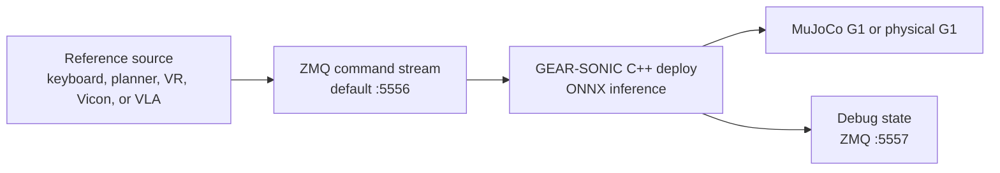

# GEAR-SONIC Whole-Body Control

GEAR-SONIC is NVIDIA's generalist whole-body controller for humanoid robots. A
higher-level source supplies a reference motion or planning command; SONIC turns
that reference into balanced G1 joint commands. It is complementary to a VLA
such as GR00T N1.7: the VLA decides what motion should happen, while SONIC is the
low-level whole-body skill layer that attempts to execute it.

## Local Status

Updated 2026-09-14.

| Item | State |
|---|---|
| Repository | `/home/zeul/GIT/GR00T-WholeBodyControl` |
| Local commit | `4f5e118` |
| Upstream relation | Local branch is 46 commits behind the fetched `origin/main` |
| Released checkpoint | Available from `nvidia/GEAR-SONIC` on Hugging Face |
| MuJoCo simulation | Working development path |
| Isaac Lab | Used for training and fine-tuning, not required for MuJoCo playback |
| Real G1 deployment | Not approved; blocked by the current left-arm telemetry fault |

!!! warning "Preserve the local work"
    The checkout has modified tracked files and untracked Vicon adapters. Do not
    pull, rebase, clean, or reset it until those changes have been reviewed and
    committed on a separate branch.

## Architecture



The repository contains three distinct surfaces:

- `gear_sonic`: training, data processing, planners, teleoperation, and Python
  orchestration.
- `gear_sonic_deploy`: low-latency C++ ONNX inference for simulation or hardware.
- `decoupled_wbc`: the earlier lower-body RL plus upper-body IK controller used
  with earlier GR00T releases.

## Known-Good MuJoCo Start

One-time environment setup from the repository root:

```bash
cd /home/zeul/GIT/GR00T-WholeBodyControl
bash install_scripts/install_mujoco_sim.sh
```

Terminal 1 starts MuJoCo:

```bash
cd /home/zeul/GIT/GR00T-WholeBodyControl
source .venv_sim/bin/activate
python gear_sonic/scripts/run_sim_loop.py
```

Terminal 2 starts the released controller:

```bash
cd /home/zeul/GIT/GR00T-WholeBodyControl/gear_sonic_deploy
bash deploy.sh sim
```

In the deployment terminal, `]` starts the policy. In the MuJoCo viewer, `9`
releases the robot. `T` plays the reference, `R` resets it, and `O` is the
controller stop command. Close an earlier simulator before starting another one.

For keyboard planner input, use:

```bash
cd /home/zeul/GIT/GR00T-WholeBodyControl/gear_sonic_deploy
bash deploy.sh --input-type keyboard sim
```

## Local Vicon Integration

The current uncommitted adapters convert exported Vicon trajectories into
SONIC's existing input protocols:

| Script | Purpose |
|---|---|
| `gear_sonic/scripts/vicon_3pt_playback.py` | Head and wrist marker trajectories to SONIC's three-point VR input |
| `gear_sonic/scripts/vicon_3pt_playlist.py` | Continuous playback of multiple three-point captures |
| `gear_sonic/scripts/vicon_planner_playback.py` | Adds measured pelvis motion and locomotion planner commands |
| `gear_sonic/scripts/vicon_smpl_playback.py` | Plug-in Gait markers to SONIC's 24-joint full-body input |
| `gear_sonic/scripts/vicon_smpl_playlist.py` | Continuous full-body capture playback |
| `gear_sonic_deploy/scripts/capture_zmq_motion.py` | Saves controller targets and measured state from debug port `5557` |

The adapters read Vicon trajectory CSVs, fill missing marker samples, smooth and
resample the trajectories, then publish at 50 Hz by default. They are useful for
simulation experiments, but they have not been validated as a real-robot control
path.

## Local Simulator Changes

The working tree also contains experimental changes for direct MuJoCo recording,
camera controls, explicit hold-until-command behavior, opt-in elastic support,
fall handling, prompt revision handling, and ZMQ debug output. These changes are
why the local checkout must be preserved before adopting upstream updates.

## What To Do Next

1. Record the dirty checkout and create a preservation branch.
2. Compare the 46 upstream commits, then port local changes deliberately.
3. Re-run the released policy in MuJoCo before testing any custom Vicon input.
4. Validate stop, fall, stale-input, and network-loss behavior in simulation.
5. Keep physical deployment blocked until the G1 hardware preflight passes.

## Upstream References

- [GR00T Whole-Body Control repository](https://github.com/NVlabs/GR00T-WholeBodyControl)
- [GEAR-SONIC project](https://nvlabs.github.io/GEAR-SONIC/)
- [GEAR-SONIC model](https://huggingface.co/nvidia/GEAR-SONIC)
- [Official deployment documentation](https://nvlabs.github.io/GR00T-WholeBodyControl/getting_started/quickstart.html)
