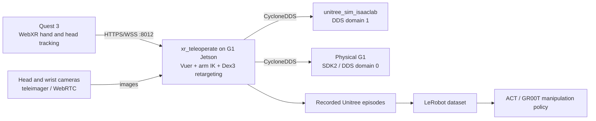
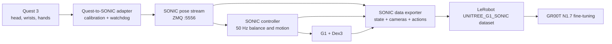

# Meta Quest 3 Teleoperation for the Unitree G1

Research and implementation record through September 14, 2026.

## Current Demo Status

Updated September 14, 2026:

- The working demo path is NVIDIA Isaac Teleop with CloudXR from `/home/zeul/IsaacLab-current`.
- The environment contains Isaac Sim `6.0.1.0`, Isaac Lab `18.0.1`, Isaac Lab Teleop `0.8.0`, PyTorch `2.11.0+cu128`, Isaac Teleop `1.4.98rc1`, and the official G1 locomanipulation task.
- The checkout is `/home/zeul/IsaacLab-current` at detached commit `d508d9587` with local changes to `xr_anchor_manager.py` and `uv.lock`. Preserve those changes before updating it.
- `IsaacContrib-PickPlace-Locomanipulation-G1-Abs` completed a full Kit/OpenXR startup with the locomotion policy, controller retargeting, and CloudXR active.
- CloudXR signaling on TCP `49100`, media on UDP `47998`, and the secure browser proxy on TCP `48322` were verified end to end with the Quest 3.
- The Quest displayed a live binocular Isaac view, Isaac acquired the OpenXR handles, and the teleoperation session started with three trackers: the headset and both controllers.
- The controller session remained active without the earlier zero-quaternion restart loop after both controllers were awake. Bidirectional CloudXR media was observed with no packet drops during the verification capture.
- The current Isaac Lab command auto-launches the CloudXR runtime. The verified run acquired the OpenXR handles and started the Isaac Teleop session without a separate runtime command.
- The verified Quest browser profile uses 1280x1280 per eye, 72 FPS, 50 Mbps, H.265, VR immersive mode, `local-floor` reference space, and workstation Tailscale address `100.101.214.44` for both signaling and media.
- The Quest 3 is currently connected through Tailscale. This works when both **Server IP** and **Media Address** are `100.101.214.44`, with **Media Port** `47998`, but the demo should use direct same-LAN Wi-Fi for lower latency.
- After a Quest reboot, the Tailscale Android process did not restart automatically. Opening the Tailscale app restored the VPN as `quest-3` (`100.127.246.67`), after which the CloudXR session reconnected normally.
- Both Touch controllers initially remained paired but in `Searching` state. Rebooting the Quest restored both to `CONNECTED_ACTIVE` with positional tracking. Hand tracking and automatic hand/controller switching were disabled so WebXR used the Touch controllers consistently.
- The in-headset **Play** control, stereo head tracking, both controller poses, reset, and G1 arm control were exercised successfully. The first Play attempt appeared unresponsive while queued inputs were settling after reconnection; it then operated normally without changing the server.
- The earlier Unitree/Vuer pipeline receives Quest head and hand samples, but its custom stereo view remained visually static in the headset. It is retained below as an implementation record, not the presentation demo.
- Quest 3 Developer Mode and USB ADB access from the Mac have been verified.
- The Quest browser was launched directly through ADB.
- WebXR passthrough hand tracking delivered 997 samples over 33.8 seconds, about 29.5 Hz.
- Head pose, both wrist poses, 25 joints per hand, pinch, and squeeze values all updated live.
- The complete Quest hand-tracking to DDS-domain-1 path was verified against the simulated G1: all 14 arm command targets changed with live hand motion.
- The pick-place simulator now publishes a 480x1280 side-by-side stereo head stream from two 640x480 cameras.
- Synthetic head-pose validation confirmed recentering, live stereo-rig rotation, angle limits, and automatic return to neutral after stale tracking.
- The immersive TeleVuer client starts cleanly with the binocular stream. Physical headset validation of eye ordering, head-turn direction, and comfort remains pending.
- The workstation uses the `isaaclab` Conda environment. Older commands referring to `unitree_sim_env` are stale for this machine.
- Isaac Sim 5.1, Isaac Lab, CycloneDDS, Unitree SDK2, the G1 Dex3 task, and its USD assets are installed.

### Real-robot bring-up status

Updated August 25, 2026:

- The preferred real-robot host is the G1 Jetson at `192.168.123.164`, not the remote workstation. Running `xr_teleoperate` there keeps SDK2/CycloneDDS on the robot's local Layer-2 network and avoids sending joint control through the routed school/Tailscale path.
- The Jetson has a user-local Miniforge environment at `~/miniforge3/envs/xr_teleop` and an official `xr_teleoperate` checkout at `~/xr_teleoperate`, pinned to commit `845b25a32f7febedf220e830952a7134897adb9d` with its matching submodules.
- The installed environment was verified with Python 3.10, NumPy 1.26.4, Pinocchio 3.1.0, PyTorch 2.3.0, OpenCV 4.10.0, CycloneDDS 0.10.2, TeleVuer 4.0.0, and Unitree SDK2 Python commit `65691c8a8bc53b98d3976dba4dbf9d5d20b2e7f5`.
- A self-signed Quest certificate for `192.168.123.164` is installed under `~/.config/xr_teleoperate/`.
- The subscribe-only `~/xr_teleoperate/probe_robot_state.py` confirmed DDS domain 0 on `enP8p1s0` and received `rt/lowstate` from the G1. DDS discovery also showed the locomotion board advertising both Dex3 command/state namespaces.
- At the last check, the G1 reported 35 zeroed joints, `active_motors=0`, and `powered_motors=0`; neither Dex3 state namespace emitted a sample. The robot or motor/hand power state must be enabled and rechecked before teleoperation.
- The Mac could initially reach the Jetson through the field-router route, but moving the Mac to the school network changed it from `192.168.8.x` to `10.17.x` and removed the route to `192.168.123.0/24`. Rejoin the field router or connect another interface to the robot LAN before continuing. Do not use routed Wi-Fi/Tailscale as the real-time DDS control path.

Updated August 27, 2026:

- The lab-only route is restored. The Mac on `192.168.8.0/24` reaches the G1 Jetson at `192.168.123.164` through the field-router/robot-router path; both passive HTTPS endpoints return HTTP 200.
- `/home/unitree/lab_teleop` now contains the read-only robot-state probe, a passive Quest WebXR probe, a preflight script, the guarded future launcher, and `LAB_TELEOP_SETUP.md`.
- `g1-quest-webxr-probe.service` was verified as a passive Quest hand-tracking endpoint at `https://192.168.123.164:8012/?ws=wss://192.168.123.164:8012`. It does not import Unitree SDK2 or create DDS publishers.
- `g1-teleimager.service` was verified with one Intel RealSense D435i RGB stream from `/dev/video4` as a monocular `640x480` head camera. A local client received a real `(480, 640, 3)` frame, and the WebRTC page used `https://192.168.123.164:60001/`.
- `tools/export_realsense_calibration.py` in this repository exports the mounted camera's color/depth intrinsics and depth-to-color extrinsics on the Jetson; keep the generated JSON private if it includes device serials.
- The persistent `/home/unitree/.config/xr_teleoperate/MOTOR_CONTROL_LOCKED` marker blocks the guarded real-robot launcher. The launcher additionally requires explicit per-session authorization and a command-line acknowledgement.
- The G1 currently has DC power but no battery. The passive DDS check still reports `active_motors=0`, `powered_motors=0`, and no Dex3 state samples. No motor or hand command publisher was launched or tested.
- Quest hand tracking was validated against the Jetson-local passive service on August 27. After entering **Virtual Reality** and putting down the Touch controllers, the service reported `tracking_ready: true`, valid 25-joint skeletons for both bare hands, and continuously changing samples at about 30 Hz.
- Vuer 0.0.60 incorrectly configured server-only TLS as `ssl.CERT_OPTIONAL`, causing Quest Browser to fail with `ERR_SSL_CLIENT_AUTH_CERT_NEEDED`. The Jetson environment's `vuer/base.py` now uses `ssl.CERT_NONE` when no client CA is configured; the original is backed up at `/home/unitree/lab_teleop/vuer-base.py.pre-client-cert-fix`. This may need to be reapplied after upgrading or recreating the environment.
- The guarded first-hardware path now holds the measured arm and Dex3 poses during initialization, ignores unavailable XR tracking instead of updating arm targets, and limits arm-joint velocity to `0.25 rad/s`. Pre-change files are backed up under `/home/unitree/lab_teleop/*pre-first-hardware-safety`.
- Zeul controls the session directly from the lab Mac with `~/bin/g1-teleop {start|status|attach|stop}`. `start` refuses until the powered-hardware preflight marker exists, requires the exact confirmation `START ARMS ONLY`, and automatically re-engages the persistent motor lock before the motor-capable process begins. `stop` requests the program's normal five-second return-home exit; R3 damping remains the independent emergency action.

Updated September 2, 2026:

- `g1-quest-webxr-probe.service`, `g1-teleimager.service`, and `g1-quest-camera-preview.service` are now **disabled and inactive** by explicit operator request. No custom ROS, Isaac, container, or motor-control process was left running on the Jetson.
- The robot reported motion mode `ai` and locomotion FSM `0` (zero torque). No external `rt/arm_sdk` publisher was detected, and the observed arm command gains and torques were zero.
- Five left-arm joints, indices `17-21`, reported `motorstate=0x80000000` without normal position, temperature, or torque telemetry. Real-robot teleoperation is blocked until the left-arm power/communication path is inspected with power removed and a later read-only probe confirms normal telemetry.
- Simulation remains the approved development path. The passive WebXR and camera services may be started temporarily for diagnosis, but they are not startup services.

The stock real-robot launcher is not passive while waiting for the operator to press `r`. During initialization it enters the required control mode, creates arm and hand command publishers, and starts the arm controller's command loop. Treat process launch as the moment actuation can begin: put the robot on its support frame, clear the workspace, place an operator at the R3 emergency control, and verify the subscribe-only probe first.

Remaining sequence:

1. With robot power off, inspect the left-arm power and communication connectors using the Unitree service procedure.
2. Put the G1 on its support frame, staff both stop controls, and obtain explicit permission for the session.
3. Power the robot and run the read-only probe until every arm joint and both hand-state streams are normal. Do not proceed while indices `17-21` show the fault state.
4. Start the passive WebXR service manually and verify stable head and dual-hand tracking for five minutes while following its journal.
5. Stop the passive service, deliberately clear the persistent lock, and use the guarded launcher without `--motion` for a low-speed arms-only test.
6. Verify process exit, tracking loss, and network loss all produce a controlled stop before recording demonstrations or separately authorizing locomotion.

The exact verified launch command is:

```bash
cd ~/IsaacLab-current
OMNI_KIT_ACCEPT_EULA=yes uv run --extra teleop isaaclab teleop run \
  --task IsaacContrib-PickPlace-Locomanipulation-G1-Abs \
  --visualizer kit \
  --xr \
  --enable_debug_visualization \
  --disable_external_cameras
```

### Articulated wheelchair Quest scene

The Poly Haven CC0 wheelchair can be used in the same maintained G1 controller-retargeting stack. The custom task removes the stock packing table and steering-wheel prop, places the articulated wheelchair in front of the G1, and retains the Agile lower-body policy, arm IK, TriHand controls, haptics, and dynamic XR anchor.

Verified working state on August 24, 2026:

- The Quest receives a live immersive stereo view and drives the G1 head-relative arm targets and locomotion controls.
- The XR view is dynamically anchored to `/World/envs/env_0/Robot/pelvis/XRAnchor`. A profile-aware `XRSettings` update in `IsaacLab-current/source/isaaclab_teleop/isaaclab_teleop/xr_anchor_manager.py` prevents the XR viewport from replacing it with the distant desktop camera during startup.
- The G1 uses the full `Physics=PhysX` USD variant. The default `SimplifiedPhysX` variant omits most shoulder, arm, elbow, and wrist collision geometry and allowed the robot arms to pass through the chair.
- Physics runs at 200 Hz, policy/control at 50 Hz, and XR rendering once per control step at 50 Hz. The upstream 100 Hz render cadence rendered twice per control step, saturated the RTX 3090, delivered about 24-26 frames per second, and made simulation time advance at roughly half speed.
- The revised 50 Hz render cadence was confirmed in the headset to run at the expected apparent speed while retaining full arm collisions.
- The wheelchair has real passive rear-wheel, caster-yaw, and front-caster joints. Its detailed visual mesh still uses a simplified primitive collision proxy, so narrow decorative frame regions are not exact physical surfaces.

Launch the task with its integrated CloudXR lifecycle:

```bash
cd ~/GIT/unitree_rl_lab
PYTHONPATH=~/GIT/unitree_rl_lab/source/unitree_rl_lab \
XDG_RUNTIME_DIR=/run/user/996 OMNI_KIT_ACCEPT_EULA=yes \
  ~/IsaacLab-current/.venv/bin/python \
  ~/IsaacLab-current/scripts/environments/teleoperation/teleop_se3_agent.py \
  --task Unitree-G1-PolyHaven-Wheelchair-Teleop \
  --external_callback unitree_rl_lab.polyhaven_wheelchair_quest.register_polyhaven_wheelchair_teleop \
  --cloudxr_env cloudxrjs --auto_launch_cloudxr --device cuda:0 \
  --visualizer none --xr --enable_debug_visualization --disable_external_cameras
```

Do not start a separate CloudXR runtime for this task. The integrated lifecycle starts the runtime after the scene and teleoperation bridge are ready, which allows Isaac to acquire the OpenXR session when the headset connects. Running the scene against a separately launched runtime left Isaac waiting for OpenXR handles while the client stream repeatedly disconnected. Explicit `--device cuda:0` is also required; omitting it selected CPU simulation and reduced the headset stream to about 4 FPS.

The task-specific settings are in `unitree_rl_lab/source/unitree_rl_lab/unitree_rl_lab/polyhaven_wheelchair_quest.py`: select `{"Physics": "PhysX"}` on the G1 spawn configuration and set `sim.render_interval` equal to `decimation` (`4`). After restarting the server, refresh the CloudXR page in the Quest, enter VR, and select **Play** again.

On this workstation, Isaac Teleop `1.4.98rc1` initially failed to start its WSS proxy because `websockets` attempted a dual-stack bind from `host=""`. Binding explicitly to `host="0.0.0.0"` in `isaacteleop/cloudxr/wss.py` fixed the `48322 address already in use` error. This local package change may need to be reapplied after recreating or upgrading the virtual environment.

The older Unitree/Vuer helper is:

```bash
cd ~/GIT/unitree_sim_isaaclab
./scripts/quest_teleop_demo.sh status
```

It provides separate foreground commands for the legacy `sim` and `teleop` processes, plus `tunnel-start`, `quest-open`, and `tunnel-stop`. The same helper also exposes `walk` and `walk-control` for the trained warehouse locomotion policy.

## NVIDIA CloudXR Demo

Start the official G1 locomanipulation environment:

```bash
cd ~/IsaacLab-current
OMNI_KIT_ACCEPT_EULA=yes uv run --extra teleop isaaclab teleop run \
  --task IsaacContrib-PickPlace-Locomanipulation-G1-Abs \
  --visualizer kit \
  --xr \
  --enable_debug_visualization \
  --disable_external_cameras
```

In the Quest browser:

1. Open [the Isaac Teleop 1.4 CloudXR.js client](https://nvidia.github.io/IsaacTeleop/client/release-1.4.x/).
2. Enter the workstation's direct LAN address when both devices share a local network. Otherwise use the verified Tailscale address `100.101.214.44`.
3. Open `https://SERVER_IP:48322/` and accept the self-signed certificate warning.
4. When using Tailscale, expand **Debug Settings**, set **Media Address** to the same Tailscale IP, and set **Media Port** to `47998`. Without this override, signaling connects but media times out.
5. Return to the CloudXR.js page and select **Connect**.
6. Wake both Quest controllers, then select **Play** from the in-headset control panel. The countdown is an intentional operator-side motion safety control.
7. Controller poses drive the arms; trigger and grip control the TriHand fingers; the left stick walks; right-stick X turns; and right-stick Y changes hip height.

Useful checks while the demo is running:

```bash
tailscale ping 100.127.246.67
ss -ltnup | grep -E '48322|49100|47998'
```

This path renders the stereo view through Isaac Sim's OpenXR runtime. Head pose and controller input therefore use the same maintained XR session instead of a custom camera/WebXR bridge.

### Quest reboot recovery

If the headset cannot reconnect after a reboot:

1. Open Tailscale on the Quest and confirm that it shows **Connected**. The Android app did not auto-start during the verified session.
2. Confirm `tailscale ping 100.127.246.67` from the workstation.
3. Confirm both Touch controllers are awake. If they remain paired but do not track, reboot the Quest; the verified healthy state is `CONNECTED_ACTIVE` with `TrackingStatus: POSITION` for both controllers.
4. Reopen the Isaac Teleop 1.4 client and use `100.101.214.44:48322` with media address `100.101.214.44` and media port `47998`.
5. Accept the server certificate if prompted, connect in VR immersive mode, and select **Play** once the in-headset control panel reports **Connected**.

## Legacy Unitree/Vuer Stereo Experiment

The helper now launches the pick-place demo with:

- `--head_stereo` to render `front_left_camera` and `front_right_camera`.
- `--xr_head_control` to subscribe to Quest orientation on `rt/xr/head_pose`.
- `--display-mode immersive` to send one rendered eye to each Quest eye.
- `--publish-head-pose` to publish the valid Quest head orientation from `xr_teleoperate`.

The first valid head packet after pressing `r` becomes neutral. Camera motion is rotation-only and is limited to 20 degrees roll, 45 degrees pitch, and 70 degrees yaw. If head packets are stale for 750 ms, the camera rig returns to neutral. The two camera offsets and their stereo baseline remain fixed while the rig rotates.

Validated on August 24, 2026:

```text
Advertised mode: binocular
Stereo frame: 480 x 1280 x 3
Left/right mean absolute pixel difference: 21.1
Synthetic 30-degree yaw frame difference: 56.1
Stale reset difference from neutral: 1.0
Observed simulator rate: approximately 20-22 Hz
```

Start each component in its own terminal:

```bash
cd ~/GIT/unitree_sim_isaaclab
./scripts/quest_teleop_demo.sh sim
```

```bash
cd ~/GIT/unitree_sim_isaaclab
./scripts/quest_teleop_demo.sh teleop
```

Then expose and open the WebXR page:

```bash
./scripts/quest_teleop_demo.sh tunnel-start
./scripts/quest_teleop_demo.sh quest-open
```

Enter VR in the Quest, face the desired neutral direction, and press `r` in the teleoperation terminal. If stereo is uncomfortable or one eye is incorrect, stop before enabling arm motion and temporarily change the helper to `--display-mode ego` for a flat first-person window.

Stop in this order:

1. Press `q` in teleoperation so the arms return home.
2. Press `Ctrl-C` in Isaac Sim.
3. Run `./scripts/quest_teleop_demo.sh tunnel-stop` so the temporary public URL is removed.

## Decision

Use NVIDIA Isaac Teleop and CloudXR for the immersive Quest 3 simulation demo. It provides the official G1 controller-retargeting, grasp, and locomotion task through Isaac Sim's OpenXR renderer. Keep Unitree's [`xr_teleoperate`](https://github.com/unitreerobotics/xr_teleoperate) stack for pose-only experiments and future real-robot data collection, but do not use its custom stereo layer for the current demonstration.

The initial sequence should be:

1. Quest 3 hand tracking to G1 29-DoF + Dex3 in `unitree_sim_isaaclab`.
2. Record and inspect a small simulated dataset.
3. Repeat on the real G1 with the robot on its support frame and locomotion disabled.
4. Convert the recordings to LeRobot and train a manipulation policy.
5. Add a Quest-to-SONIC adapter for whole-body demonstrations and GR00T N1.7 training.

Do not start by using Quest full-body estimation to command the G1 legs. Quest 3 directly tracks the headset, hands, and controllers, but its lower-body pose is software-estimated without tracked feet. Use SONIC or Unitree's locomotion controller for balance and legs while Quest controls the upper body.

## What Works Now

The current Unitree v1.6 stack provides:

- Meta Quest 3 through the headset browser; no custom Quest application is required.
- G1 29-DoF arm inverse kinematics.
- Dex3 finger retargeting from a tracked human hand skeleton.
- Simulation through `unitree_sim_isaaclab` using the same DDS command path as the real robot.
- First-person robot camera streaming through WebRTC, or Quest passthrough when the operator can see the robot directly.
- Episode recording for conversion to LeRobot datasets.
- Locomotion alongside upper-body control through Unitree motion mode.

One important implementation constraint is easy to miss: Unitree's current code rejects `--input-mode controller --ee dex3`. Controllers can drive the arms and locomotion inputs, but Dex3 finger retargeting requires `--input-mode hand`. In hand mode, the Unitree R3 remote controls locomotion; Quest controller joysticks are not the locomotion input.

Unitree lists Quest 3 as a supported XR device and provides a generic hand-tracking mode, but its release history specifically says Quest 3 was tested with controllers. Therefore, Quest hand skeleton to Dex3 retargeting is the first simulation acceptance test, not a capability to assume before testing this exact headset/browser version.

## Recommended Architecture



For whole-body GR00T work, the target architecture is different:



The SONIC dataset action is not the same as Unitree's raw arm-and-hand recording. SONIC/GR00T uses a 78-dimensional action: a 64-dimensional SONIC motion token plus seven joints for each hand. For eventual GR00T + SONIC deployment, collect through the SONIC data exporter instead of treating a raw 28-dimensional Unitree arm/Dex3 dataset as directly interchangeable.

## Route Comparison

| Route | Use now? | Strength | Limitation |
|---|---:|---|---|
| Unitree `xr_teleoperate` | Yes | Fastest path to Quest 3, G1, Dex3, simulation, and recording | Dex3 needs hand mode; not a SONIC-native dataset |
| NVIDIA Isaac Teleop + CloudXR | Simulation only for now | Quest 3 controller tracking, simulator teleop, recording, and synthetic-data tools | The current SONIC real-robot integration is documented only for a G1 with a Thor backpack; this lab G1 uses a Jetson Orin setup |
| Custom Meta Unity application | Later, only if needed | Can expose Meta full-body joints, hands, controllers, and Quest passthrough cameras | More code and deployment work; lower-body joints are inferred and should not directly command real G1 legs |
| XRoboToolkit Quest client | Not the primary route | Native pose streaming at up to 90 Hz | Its Quest client still lists body tracking as unavailable, while SONIC's existing XRoboToolkit path expects a 24-joint body pose |

## Network Layout

Keep the control path on a local network. Do not put WebXR tracking, CloudXR media, or DDS control through Tailscale or a WAN connection.

Recommended physical layout:

```text
Quest 3 -- 5/6 GHz Wi-Fi -- dedicated access point -- Ethernet -- workstation
                                                         |
                                                         +-- G1 robot network
                                                             192.168.123.0/24
```

Requirements:

- Quest and the workstation's WebXR address must be mutually reachable.
- The workstation's robot-facing interface must be on the G1 Layer-2 network for CycloneDDS discovery.
- G1 Jetson/PC2 is `192.168.123.164`; the locomotion board is `192.168.123.161`.
- Use a workstation address such as `192.168.123.99/24` on the dedicated robot-facing NIC.
- Pass the exact robot-facing interface to `--network-interface` on real hardware.
- Keep internet access on a separate interface. Do not add a default gateway to the robot-only interface.

The workstation was not on `192.168.123.0/24` during this research snapshot. Its active addresses were `192.168.2.240` and `192.168.90.254`, so real-robot DDS requires reconnecting or configuring the dedicated robot-facing NIC first.

CloudXR is more demanding than Unitree's pose-only WebXR path. NVIDIA recommends 200 Mbps, 20-30 ms pose-to-frame latency, about 1 ms jitter, no packet loss, and 5 or 6 GHz Wi-Fi. A VPN is explicitly discouraged for the media path.

## Phase 1: Quest to Isaac Lab

Pin the first validation to the official Unitree v1.6 code, or record the exact newer commit used. The observed v1.6 repository head was `845b25a32f7febedf220e830952a7134897adb9d`.

Install `xr_teleoperate` in a separate environment:

```bash
cd ~/GIT
git clone --recurse-submodules https://github.com/unitreerobotics/xr_teleoperate.git

conda create -n xr_teleop python=3.10 pinocchio=3.1.0 numpy=1.26.4 -c conda-forge
conda activate xr_teleop

cd ~/GIT/xr_teleoperate/teleop/teleimager
pip install -e . --no-deps
cd ../televuer
pip install -e .
cd ~/GIT/xr_teleoperate
pip install -r requirements.txt

cd ~/GIT
git clone https://github.com/unitreerobotics/unitree_sdk2_python.git
cd unitree_sdk2_python
pip install -e .
```

Generate the HTTPS certificate used by the Quest browser:

```bash
cd ~/GIT/xr_teleoperate/teleop/televuer
openssl req -x509 -nodes -days 365 -newkey rsa:2048 \
  -keyout key.pem -out cert.pem
mkdir -p ~/.config/xr_teleoperate
cp cert.pem key.pem ~/.config/xr_teleoperate/
```

Start the official G1 29-DoF + Dex3 simulation. On the current workstation the environment is named `isaaclab`:

```bash
conda activate isaaclab
cd ~/GIT/unitree_sim_isaaclab
python sim_main.py \
  --device cpu \
  --enable_cameras \
  --task Isaac-PickPlace-Cylinder-G129-Dex3-Joint \
  --enable_dex3_dds \
  --robot_type g129
```

After the simulator reports `controller started, start main loop...`, launch teleoperation in a second terminal:

```bash
conda activate xr_teleop
cd ~/GIT/xr_teleoperate/teleop
python teleop_hand_and_arm.py \
  --input-mode hand \
  --display-mode pass-through \
  --arm G1_29 \
  --ee dex3 \
  --sim \
  --record
```

In the Quest browser, open:

```text
https://<workstation-ip>:8012/?ws=wss://<workstation-ip>:8012
```

Accept the local certificate warning, select **Virtual Reality**, and allow the WebXR permissions. Align the human arms with the simulated robot's initial arm pose before pressing `r`. Press `s` to start and stop each recorded episode.

Use `--display-mode immersive` later when the simulated or robot camera feed is configured. Passthrough is simpler for the first tracking test.

## Phase 2: Real G1, Arms and Hands Only

Do this only after the complete sequence works smoothly in simulation.

1. Put the G1 on its support frame.
2. Disable or omit motion mode so the test cannot command walking.
3. Place an operator at the R3 remote and another at the workstation stop control.
4. Verify Dex3 state topics and arm state before enabling command output.
5. Start with low reach speed and a clear workspace.

Run the robot camera service on the G1 Jetson/PC2 if an immersive view or image recording is required. Otherwise, use Quest passthrough and watch the robot directly for the first test.

The host command is:

```bash
conda activate xr_teleop
cd ~/GIT/xr_teleoperate/teleop
python teleop_hand_and_arm.py \
  --input-mode hand \
  --display-mode pass-through \
  --arm G1_29 \
  --ee dex3 \
  --img-server-ip 192.168.123.164 \
  --network-interface <robot-facing-interface> \
  --record
```

Do not add `--motion` during the first hardware tests. After arm/hand operation, stop behavior, and network-loss behavior are verified, `--motion` can let the Unitree locomotion controller run alongside upper-body teleoperation. In hand-tracking mode, use the R3 remote for walking.

## Phase 3: Dataset and Policy

Unitree recording produces task episodes under `xr_teleoperate/teleop/utils/data` by default. Convert those episodes with the current `unitree_lerobot` tooling to a LeRobot v3 dataset.

For manipulation-only experiments:

- Record the head camera and, if available, wrist cameras.
- Keep task wording and camera names identical across every episode.
- Reject episodes with tracking loss, hand occlusion, collisions, or human recovery actions.
- Start with one short task such as grasping one wheelchair handle from a fixed standing pose.
- Train and evaluate ACT or another LeRobot-supported policy before expanding task scope.

The existing local Dex3 ACT work uses a 28-dimensional arm-and-hand state/action representation. Quest demonstrations can support that path after conversion and schema validation.

For GR00T + SONIC:

- Use the SONIC exporter so the dataset is tagged `UNITREE_G1_SONIC`.
- Record robot state, ego/wrist images, and the SONIC teleoperation action together.
- Collect at least 50-100 clean demonstrations per target task as the SONIC guide recommends.
- Fine-tune `nvidia/GR00T-N1.7-3B`.
- GR00T produces 40-action chunks at about 2.5 Hz; SONIC decodes and executes the whole-body command at 50 Hz.

## Quest-to-SONIC Adapter

The smallest useful adapter should not synthesize a complete human skeleton. It should publish the signals SONIC already uses in `VR_3PT` mode:

- Left wrist pose: position + quaternion.
- Right wrist pose: position + quaternion.
- Head/neck pose: position + quaternion.
- Dex3 hand targets from the Quest hand skeleton.
- Planner direction and heading from a separate safe input, initially keyboard or R3.
- Start, stop, calibration, and recording events.

Implementation requirements:

1. Convert the WebXR coordinate frame to SONIC's robot frame and normalize quaternion ordering.
2. Capture a neutral-pose calibration before enabling output.
3. Rate-limit and filter wrist targets.
4. Reject invalid or stale hand/head poses instead of holding arbitrary targets forever.
5. Publish a monotonic timestamp and sequence number.
6. Trigger a controlled stop when tracking or the network is stale.
7. Emit the existing SONIC `pose` message on ZMQ port `5556` so the C++ deployment and data exporter do not need a second control interface.

This adapter can reuse Unitree's Vuer/WebXR data source and SONIC's existing calibration, `VR_3PT`, hand, and ZMQ message code. That is lower risk than starting with a custom Unity application or replacing SONIC's control loop.

## Other Routes

### Isaac Teleop and CloudXR

NVIDIA now has a simulator-native Quest 3 route through Isaac Teleop and CloudXR. Isaac Sim can receive headset/controller poses, run IK/grasp/locomotion controllers, record HDF5 episodes, and replay them for synthetic-data generation. The current upstream SONIC code also contains an `--input-source isaac-teleop` path and a Quest 3 CloudXR profile.

Use this later for simulator experiments. The currently documented SONIC real-robot path is limited to a G1 with a Thor backpack, while this project has a Jetson Orin robot computer. It also adds a high-bandwidth stereo media path that is unnecessary for the first Unitree WebXR test.

### Custom Meta Unity Application

Meta's current Movement SDK exposes OpenXR full-body, hand, eye, and face tracking. A custom application could stream an 84-joint full-body skeleton and access Quest 3 passthrough RGB cameras. This is useful if the project later needs operator-view video, custom UI, or body-pose labels.

It is not the first control route. Quest cannot directly observe feet in many poses and must predict occluded lower-body motion. Treat those legs as an estimated demonstration signal for offline processing, not a real-time target for physical G1 leg joints.

### XRoboToolkit Quest

The Quest XRoboToolkit client streams head, controller, and hand poses and reports a 90 Hz pose channel. However, its own documentation still marks Quest body tracking as "Coming soon." SONIC's existing XRoboToolkit reader waits for a 24-joint body array, so the Quest client is not currently a drop-in replacement for the PICO + ankle tracker setup.

## Known Risks

- Unitree has open user reports where a Quest 3 connects through `vuer.ai` but the locally hosted `:8012` page disconnects when entering VR. Verify the local client in simulation before any hardware test. Do not make the public `vuer.ai` fallback part of the real-robot control path without reviewing and pinning what it serves.
- Self-signed HTTPS certificates are a common source of failed WebXR or WebRTC sessions. Trust both the workstation WebXR certificate and the robot camera certificate in the Quest browser before troubleshooting tracking code.
- Hand tracking can disappear when hands overlap, turn away from the headset, or are hidden by the robot or wheelchair. A stale-pose watchdog is mandatory.
- Quest has no direct robot force feedback. Operators see contact but do not feel handle forces, so demonstrations must use conservative motion and visual verification.
- DDS discovery generally requires the workstation and G1 to share the same Layer-2 network. A routed Tailscale path is not a replacement for the robot-facing interface.

## Acceptance Gates

Do not advance until each gate passes:

| Gate | Pass condition |
|---|---|
| WebXR input | Head, both wrists, and both hand skeletons remain valid for five minutes |
| Simulation arms | No jumps on start, stop, recalibration, or reconnect |
| Simulation hands | Dex3 opens, closes, and pinches without joint-limit chatter |
| Recording | Images, state, action, timestamps, and task label align in one episode |
| Hardware on supports | Tracking loss and process exit both produce a controlled stop |
| Hardware standing | Upper-body command does not destabilize the standing controller |
| Motion mode | Slow commanded walk while upper-body tracking remains bounded |
| Learning | Held-out rollouts succeed without replay, snapping, or operator correction |

## Primary Sources

- [Unitree `xr_teleoperate` v1.6](https://github.com/unitreerobotics/xr_teleoperate)
- [Unitree `unitree_lerobot`](https://github.com/unitreerobotics/unitree_lerobot)
- [Unitree `unitree_sim_isaaclab`](https://github.com/unitreerobotics/unitree_sim_isaaclab)
- [NVIDIA GR00T Whole-Body Control](https://github.com/NVlabs/GR00T-WholeBodyControl)
- [Isaac Lab: Isaac Teleop](https://isaac-sim.github.io/IsaacLab/develop/source/features/isaac_teleop.html)
- [Isaac Lab: CloudXR teleoperation setup](https://isaac-sim.github.io/IsaacLab/develop/source/how-to/cloudxr_teleoperation.html)
- [NVIDIA Isaac Teleop](https://github.com/NVIDIA/IsaacTeleop)
- [NVIDIA CloudXR network requirements](https://docs.nvidia.com/cloudxr-sdk/latest/requirement/network_setup.html)
- [Meta Unity Movement SDK sample](https://github.com/oculus-samples/Unity-Movement)
- [Meta Quest passthrough camera API](https://developers.meta.com/horizon/documentation/unity/unity-pca-overview/)
- [XRoboToolkit Quest client](https://github.com/XR-Robotics/XRoboToolkit-Unity-Client-Quest)
