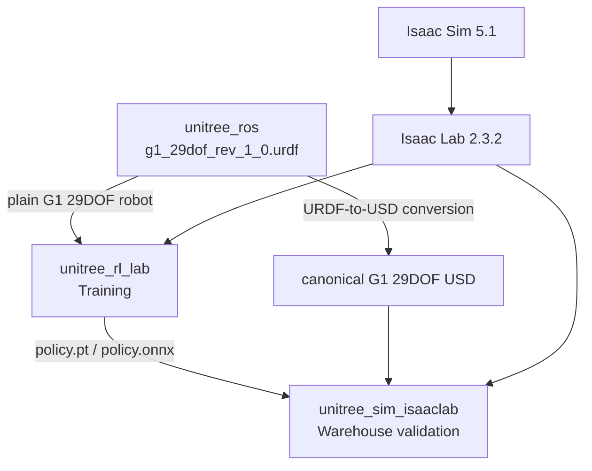

# RL Training Guide — G1 Locomotion from Scratch

Step-by-step reproduction guide for training the G1-29DOF locomotion policy and running it in simulation. For the larger repo/file-format map, see [Unitree Developer Workflow](developer-workflow.md).

---

## Repositories

Three repos are needed for the workflow used here. All live in `~/GIT/`.

| Repo | Purpose | Location |
|------|---------|----------|
| `unitree_ros` | Robot model source files: URDFs and meshes | `~/GIT/unitree_ros/` |
| `unitree_rl_lab` | Isaac Lab RL training framework: train, evaluate, export | `~/GIT/unitree_rl_lab/` |
| `unitree_sim_isaaclab` | Rich Isaac Sim validation/control app with DDS, sensors, and warehouse scenes | `~/GIT/unitree_sim_isaaclab/` |

For this training run, `unitree_ros` was the source of truth for the robot URDF. Unitree's Hugging Face `unitree_model` dataset is the current official source for Unitree's preconverted USD assets, but it does not replace the exact `g1_29dof_rev_1_0.urdf` file used to train this policy.



---

## Prerequisites

Isaac Sim and Isaac Lab must be installed in the `isaaclab` conda environment before cloning the Unitree repos.

```bash
# 1. Install Isaac Sim 5.1 (requires Python 3.11 and GLIBC 2.35+)
conda activate isaaclab
pip install "isaacsim[all,extscache]==5.1.0" --extra-index-url https://pypi.nvidia.com

# 2. Clone and install Isaac Lab 2.3.2
git clone https://github.com/isaac-sim/IsaacLab.git
cd IsaacLab
./isaaclab.sh --install
```

---

## Step 1: Clone the Repos

```bash
cd ~/GIT
git clone https://github.com/unitreerobotics/unitree_rl_lab.git
git clone https://github.com/unitreerobotics/unitree_ros.git
git clone https://github.com/unitreerobotics/unitree_sim_isaaclab.git
```

---

## Step 2: Configure the URDF Path

`unitree_rl_lab` needs to know where the G1 URDF files live. Edit this file:

```
~/GIT/unitree_rl_lab/source/unitree_rl_lab/unitree_rl_lab/assets/robots/unitree.py
```

Set the path to the cloned `unitree_ros` directory:

```python
UNITREE_ROS_DIR = "/home/zeul/GIT/unitree_ros"
```

Then in the same file, switch the G1 29DOF config to use URDF instead of USD. Find the `UNITREE_G1_29DOF_CFG` section and point it at:

```text
robots/g1_description/g1_29dof_rev_1_0.urdf
```

For our project, that specific file was chosen because it matches the `Unitree-G1-29dof-Velocity` task: plain G1 29DOF Rev 1.0, no dexterous hands, no base-fixed manipulation setup, and no locked-waist variant.

- **Uncomment** `UnitreeUrdfFileCfg`
- **Comment out** `UnitreeUsdFileCfg`

This tells Isaac Lab to load the G1 from the URDF robot description instead of Unitree's pre-packaged USD scene file. Training directly on USD is possible, but only if the USD has the same robot interface the task expects: same joints, same names/order, same 29 action targets, same default pose, same actuator setup, and compatible physics settings.

---

## Step 3: Install unitree_rl_lab

```bash
conda activate isaaclab
cd ~/GIT/unitree_rl_lab
pip install -e "source/unitree_rl_lab"
```

The `-e` flag installs in editable mode, so changes to the source files take effect immediately without reinstalling.

---

## Step 4: Train the Policy

```bash
conda activate isaaclab
cd ~/GIT/unitree_rl_lab
python scripts/rsl_rl/train.py --headless --task Unitree-G1-29dof-Velocity
```

`--headless` skips the GUI, which is much faster. 4,096 robots run in parallel on the GPU.

**What happens:**

1. Isaac Sim loads the G1 URDF and spawns 4,096 robots in a grid
2. Each robot gets a random velocity command each episode
3. Rewards and penalties are calculated every timestep
4. The neural network updates its weights based on what worked and what did not
5. Checkpoints are saved every 100 iterations to `logs/rsl_rl/unitree_g1_29dof_velocity/<timestamp>/`

Training runs until you stop it (Ctrl+C) or the reward plateaus. A usable policy typically emerges around iteration 1,000. We ran to 7,200.

### Resuming a Training Run

To continue from where you left off:

```bash
# Resume from latest checkpoint in a run
python scripts/rsl_rl/train.py --headless --task Unitree-G1-29dof-Velocity \
  --resume \
  --load_run 2026-03-06_14-30-46

# Resume from a specific checkpoint
python scripts/rsl_rl/train.py --headless --task Unitree-G1-29dof-Velocity \
  --resume \
  --load_run 2026-03-06_14-30-46 \
  --checkpoint model_7200.pt
```

The run folder name is the timestamp directory under `logs/rsl_rl/unitree_g1_29dof_velocity/`.

---

## Step 5: Monitor Training

In a second terminal while training runs:

```bash
conda activate isaaclab
cd ~/GIT/unitree_rl_lab
tensorboard --logdir logs/rsl_rl/ --host 0.0.0.0
```

Open [http://workstation:6006](http://workstation:6006) in a browser. Key metrics to watch:

| Metric | Good trend | What it means |
|--------|-----------|---------------|
| `Mean reward` | Increasing | Overall policy quality |
| `Episode_Termination/bad_orientation` | Decreasing toward 0 | Fall rate |
| `Episode_Reward/track_lin_vel_xy` | Increasing | Velocity command accuracy |
| `Episode_Length/mean` | Increasing toward max | Robots staying alive longer |

---

## Policy Observation Sources

The G1 walking policy was trained from the observation terms in:

```text
~/GIT/unitree_rl_lab/source/unitree_rl_lab/unitree_rl_lab/tasks/locomotion/robots/g1/29dof/velocity_env_cfg.py
```

The actor policy observes `base_ang_vel`, `projected_gravity`, velocity commands, relative joint positions, relative joint velocities, and the previous action. With history length 5, those terms become the 480-value policy input expected by the exported network.

`base_ang_vel` and `projected_gravity` are IMU-like signals, but they were not read from an active Isaac IMU sensor. Isaac Lab's observation functions read them from the simulated articulation state:

| Observation | Isaac Lab source | Real-robot equivalent |
|---|---|---|
| `base_ang_vel` | `asset.data.root_ang_vel_b` | Gyro/body angular velocity from the robot IMU or state estimator |
| `projected_gravity` | `asset.data.projected_gravity_b` | Gravity direction in the body frame, computed from the estimated base orientation |

`projected_gravity` is computed by rotating the world gravity vector into the robot base frame using the simulated root orientation. In simulation this is ground-truth state with configured observation noise. On hardware, the same policy input should be produced from the real robot's IMU/state-estimator output, with the same axis convention, scaling, history, and update rate.

The training scene also defines a `height_scanner` raycaster, but the height-scan observation is commented out in the G1 29DOF policy/critic config used here. Camera and lidar data were not part of this walking policy's training observations.

---

## Reward Configuration

The reward function is defined in:

```
~/GIT/unitree_rl_lab/source/unitree_rl_lab/unitree_rl_lab/tasks/locomotion/robots/g1/29dof/velocity_env_cfg.py
```

Positive terms (things the robot is rewarded for):

| Term | Weight | Description |
|------|--------|-------------|
| `track_lin_vel_xy` | +1.0 | Follow commanded forward/lateral speed |
| `track_ang_vel_z` | +0.5 | Follow commanded yaw (turning) rate |
| `alive` | +0.15 | Survive the episode without falling |
| `gait` | +0.5 | Maintain a natural alternating gait |
| `feet_clearance` | +1.0 | Lift feet cleanly off the ground |

Penalty terms (negative weights, things to minimize):

| Term | Weight | Description |
|------|--------|-------------|
| `flat_orientation_l2` | -5.0 | Penalizes tilting (stay upright) |
| `base_height` | -10.0 | Penalizes deviating from 0.78 m standing height |
| `dof_pos_limits` | -5.0 | Penalizes joints approaching their limits |
| `base_linear_velocity` (z) | -2.0 | Penalizes bouncing (vertical movement) |
| `joint_deviation_arms` | -0.1 | Keeps arms near default pose |
| `action_rate` | -0.05 | Penalizes rapid changes in joint targets |
| `energy` | -2e-5 | Penalizes unnecessary energy use |

To tune the policy behavior, change these weights. Increasing `track_lin_vel_xy` makes the robot prioritize speed over stability. Increasing `flat_orientation_l2` makes it more conservative about tilting. Weights are just floating point numbers in that config file.

---

## Step 6: Play Back the Trained Policy

To run the policy in simulation with a GUI:

```bash
conda activate isaaclab
cd ~/GIT/unitree_rl_lab

# Basic playback — loads latest checkpoint, opens GUI
python scripts/rsl_rl/play.py --task Unitree-G1-29dof-Velocity

# Control how many robots are shown (default is 32 or so)
python scripts/rsl_rl/play.py --task Unitree-G1-29dof-Velocity --num_envs 30

# Load a specific checkpoint (instead of the latest)
python scripts/rsl_rl/play.py --task Unitree-G1-29dof-Velocity \
  --load_run 2026-03-06_14-30-46 \
  --checkpoint model_7200.pt

# Record a video of the playback
python scripts/rsl_rl/play.py --task Unitree-G1-29dof-Velocity \
  --video --video_length 300
```

This loads the checkpoint from `logs/rsl_rl/unitree_g1_29dof_velocity/` and opens a GUI window. The Isaac Sim viewport shows the robots walking. Use the keyboard or gamepad to send velocity commands.

!!! note "Requires a display"
    `play.py` opens the full Isaac Sim GUI. Run it from a desktop session (Sunshine/Moonlight remote desktop), not from an SSH terminal. For headless playback with video recording, add `--headless --video`.

---

## Output Files

After training, checkpoints are saved here:

```
~/GIT/unitree_rl_lab/logs/rsl_rl/unitree_g1_29dof_velocity/2026-03-06_14-30-46/
├── exported/
│   ├── policy.onnx       <- portable policy, deploy this
│   └── policy.pt         <- PyTorch checkpoint, for fine-tuning
├── params/
│   ├── velocity_env_cfg.py   <- full environment config snapshot
│   └── deploy.yaml           <- PD gains, joint order, obs scaling
├── model_100.pt          <- checkpoint at iter 100
├── model_200.pt          <- checkpoint at iter 200
│   ...
└── model_7200.pt         <- final checkpoint
```

The `policy.onnx` file is what gets deployed. It is a portable format that runs on any machine with ONNX Runtime -- the workstation, the Jetson, or a laptop.

---

## Step 7: Validate in unitree_sim_isaaclab

Copy the trained JIT policy to the simulation environment:

```bash
cp ~/GIT/unitree_rl_lab/logs/rsl_rl/unitree_g1_29dof_velocity/2026-03-06_14-30-46/exported/policy.pt \
   ~/GIT/unitree_sim_isaaclab/assets/model/our_policy.pt
```

### Launch the simulation

The custom task `Isaac-Locomotion-G129-Warehouse` runs the trained locomotion policy inside the richer `unitree_sim_isaaclab` stack. It uses a plain G1 29DOF USD that was generated from the same `unitree_ros` URDF lineage as training:

```text
unitree_sim_isaaclab/assets/robots/g1-29dof-locomotion/g1_29dof_rev_1_0.usd
```

That USD is needed because Isaac Sim scenes, warehouse assets, cameras, and RTX lidar are USD-native. The USD must still match the training robot interface. A visually similar G1 USD is not enough if it is a dexterous-hand, base-fixed, whole-body manipulation, 23DOF, or locked-waist variant.

```bash
conda activate isaaclab
cd ~/GIT/unitree_sim_isaaclab
python sim_main.py --device cuda:0 --enable_cameras \
  --task Isaac-Locomotion-G129-Warehouse \
  --action_source custom_rl \
  --model_path assets/model/our_policy.pt \
  --robot_type g129 \
  --camera_include front_camera \
  --enable_wholebody_dds
```

### Control the robot with keyboard

In a separate terminal:

```bash
conda activate isaaclab
cd ~/GIT/unitree_sim_isaaclab
python send_commands_keyboard.py
```

Controls (the terminal with the keyboard script must have focus):

| Key | Action |
|-----|--------|
| W/S | Forward / Backward |
| A/D | Strafe left / right |
| Z/X | Turn left / right |
| C | Crouch |
| Q | Quit |

### How it works

The v2 action provider (`action_provider_custom_rl_v2.py`) uses Isaac Lab's own `ObservationManager` and `ActionManager` to construct observations and apply actions. This guarantees identical behavior to training -- no manual observation construction, no action scaling bugs, no joint ordering issues.

The provider reads velocity commands from DDS (keyboard or Nav2), overrides the env's command manager, then runs the standard Isaac Lab pipeline: compute observations, run the policy, process and apply actions, step physics.

### Cameras and Other Sensors

The locomotion policy does not consume camera, lidar, or IMU sensor objects. Those sensors are for validation, visualization, ROS bridging, SLAM, and downstream autonomy.

In `unitree_sim_isaaclab`, active cameras are created by task scene configs with Isaac Lab `CameraCfg` objects. Unitree's reusable camera presets are in:

```text
~/GIT/unitree_sim_isaaclab/tasks/common_config/camera_configs.py
```

Manipulation tasks usually add cameras like this:

```python
front_camera = CameraPresets.g1_front_camera()
left_wrist_camera = CameraPresets.left_gripper_wrist_camera()
right_wrist_camera = CameraPresets.right_gripper_wrist_camera()
```

That does two things when the environment is constructed: it creates camera prims in the USD stage, and it registers runtime sensors under names such as `env.scene["front_camera"]`. Camera observation or bridge code then reads image tensors from `env.scene["front_camera"].data.output["rgb"]`.

The warehouse locomotion task used the same Isaac Lab mechanism but defined its head camera directly in the scene config as `head_camera = CameraCfg(...)`. The camera is attached under the robot in the USD scene so it moves with the G1. The lidar path was handled separately as an RTX lidar prim/sensor, and the IMU bridge derived IMU-like values from robot simulation state rather than from the camera config.

### RGB-D RTAB-Map Test Path

For camera-based SLAM testing, the sim now has an optional raw RGB-D stream in addition to the existing compressed JPEG stream. The walking policy still does not use camera data; this path is only for SLAM/perception validation.

The simulator flag is:

```bash
--camera_rgbd --camera_rgbd_name head_camera --camera_rgbd_port 55556
```

The RGB-D bridge lives in:

```text
~/workspaces/isaac_ros-dev/g1/scripts/rgbd_camera_bridge.py
```

It publishes:

| Topic | Message | Notes |
|---|---|---|
| `/head_camera/color/image_raw` | `sensor_msgs/Image` | `rgb8`; raw RTAB-Map input, not the operator preview |
| `/head_camera/depth/image_raw` | `sensor_msgs/Image` | `32FC1`, meters; raw RTAB-Map input, not the operator preview |
| `/head_camera/color/camera_info` | `sensor_msgs/CameraInfo` | Pinhole intrinsics from the current `CameraCfg` |
| `/head_camera/depth/camera_info` | `sensor_msgs/CameraInfo` | Same intrinsics as color |

The compressed preview bridge publishes:

| Topic | Message | Notes |
|---|---|---|
| `/head_camera/image/compressed` | `sensor_msgs/CompressedImage` | JPEG preview for Foxglove/Lichtblick and driving |

Both the compressed image and camera info should use `head_camera_optical_frame`. A previous mismatch had the preview on `head_camera` and camera info on `head_camera_optical_frame`, which caused Foxglove warnings.

RTAB-Map should consume the raw RGB-D topics in the background:

```text
/head_camera/color/image_raw
/head_camera/depth/image_raw
/head_camera/color/camera_info
```

Foxglove should normally display the compressed preview and lightweight map outputs:

```text
/head_camera/image/compressed
/rtabmap/map
/rtabmap/grid_prob_map
/rtabmap/odom
/rtabmap/mapPath
/tf
/tf_static
```

Do not keep the raw RGB/depth topics or the full colored global point cloud open in the browser while driving. The raw topics are RTAB inputs, and `/rtabmap/cloud_map` is an accumulated colored `PointCloud2` global map. In testing, `/rtabmap/cloud_map` measured roughly 12 MB per message and 13-18 MB/s when subscribed. That topic is much heavier than the compressed camera preview, which was roughly 0.6 MB/s. Sending the global point cloud through Foxglove over the network can make the browser camera panel drop to very low frame rates even when Isaac Sim over Moonlight is smooth.

Use the helper scripts in `unitree_sim_isaaclab`:

```bash
cd ~/GIT/unitree_sim_isaaclab

# Restart sim + camera + cmd_vel, without RTAB-Map.
./scripts/restart_camera_stack.sh

# Start RGB-D RTAB-Map against the running camera stack.
./scripts/start_rtabmap.sh

# Stop RTAB-Map while keeping the camera/driving stack alive.
./scripts/stop_rtabmap.sh

# Lightweight Foxglove bridge for driving and overview.
./scripts/start_foxglove_light.sh 8765

# Debug-only Foxglove bridge that exposes the colored global cloud map.
./scripts/start_foxglove_cloud_map.sh 8765
```

`./scripts/restart_rtabmap.sh` now composes the camera stack plus `start_rtabmap.sh`.

Current measured behavior after tuning:

| Stream | Purpose | Approx observed rate/size |
|---|---|---|
| `/head_camera/image/compressed` | Operator preview | About 23 Hz, about 0.6 MB/s |
| `/head_camera/color/image_raw` | RTAB RGB input | About 4 Hz after bridge skip/downsample settings |
| `/head_camera/depth/image_raw` | RTAB depth input | About 4 Hz after bridge skip/downsample settings |
| `/rtabmap/cloud_map` | Accumulated colored global point cloud | About 12 MB per message in the tested map |

For heavy 3D map inspection, prefer RViz2 or `rtabmap_viz` running on the workstation and viewed through Moonlight. Moonlight streams the already-rendered desktop as compressed video. Foxglove streams raw ROS messages into the browser and then asks the browser to parse/render them, which is a poor fit for a large live `PointCloud2`. The ROS container currently has `rviz2` and `rtabmap_viz` installed, but GUI display forwarding from the container still needs to be wired before those tools can open directly from the container.

The container image must include `ros-jazzy-rtabmap-ros`; the local `g1/Dockerfile` in `~/workspaces/isaac_ros-dev` was updated for that.

### Alternative: Quick demo without DDS

For a quick demo without DDS or keyboard control (robot follows random velocity commands):

```bash
conda activate isaaclab
cd ~/GIT/unitree_rl_lab
python scripts/rsl_rl/play_warehouse.py --num_envs 1
```

This uses Isaac Lab's built-in `env.step()` loop with the training config and a warehouse terrain.

---

## Asset Parity Checklist

Before moving a policy from `unitree_rl_lab` into `unitree_sim_isaaclab`, check:

| Check | Expected for this policy |
|---|---|
| Robot variant | Plain G1 29DOF Rev 1.0 |
| Source file | `unitree_ros/robots/g1_description/g1_29dof_rev_1_0.urdf` |
| Policy output | 29 action targets |
| Joint names/order | Same Isaac Lab action manager ordering as training |
| Observation shape/history | Same `Unitree-G1-29dof-Velocity` config |
| Default joint pose | Same standing pose as training |
| Actuator config | Same stiffness, damping, effort limits, velocity limits, and armature |
| Physics timing | Same decimation and timestep |
| Collision/solver settings | Reviewed after URDF-to-USD conversion |

Most of the early mapping trouble came from trying to bridge this boundary manually. The v2 provider fixed the high-risk part by using Isaac Lab managers instead of reimplementing observation construction and action application by hand.

---

## Quick Reference

```bash
conda activate isaaclab
cd ~/GIT/unitree_rl_lab

# Start a new training run
python scripts/rsl_rl/train.py --headless --task Unitree-G1-29dof-Velocity

# Resume a training run
python scripts/rsl_rl/train.py --headless --task Unitree-G1-29dof-Velocity \
  --resume --load_run 2026-03-06_14-30-46

# Stop training
Ctrl+C

# Monitor training (open http://workstation:6006)
tensorboard --logdir logs/rsl_rl/ --host 0.0.0.0

# Play back with 20 robots visible
python scripts/rsl_rl/play.py --task Unitree-G1-29dof-Velocity --num_envs 20

# Play in warehouse (quick demo, random velocity commands)
python scripts/rsl_rl/play_warehouse.py --num_envs 1

# Trained policy location
ls logs/rsl_rl/unitree_g1_29dof_velocity/2026-03-06_14-30-46/exported/

# Validate in unitree_sim_isaaclab with DDS keyboard control
cd ~/GIT/unitree_sim_isaaclab
python sim_main.py --device cuda:0 --enable_cameras \
  --task Isaac-Locomotion-G129-Warehouse \
  --action_source custom_rl \
  --model_path assets/model/our_policy.pt \
  --robot_type g129 --camera_include front_camera \
  --enable_wholebody_dds

# Keyboard control (separate terminal)
python send_commands_keyboard.py
```

---

## About `Unitree-G1-29dof-Velocity`

This is a **Gymnasium task ID** -- a registered name that maps to the full environment configuration. It was created by Unitree and ships inside `unitree_rl_lab`.

When you pass `--task Unitree-G1-29dof-Velocity`, it looks up this registration:

```python
# source/unitree_rl_lab/unitree_rl_lab/tasks/locomotion/robots/g1/29dof/__init__.py
gym.register(
    id="Unitree-G1-29dof-Velocity",
    kwargs={
        "env_cfg_entry_point":    "velocity_env_cfg:RobotEnvCfg",
        "rsl_rl_cfg_entry_point": "rsl_rl_ppo_cfg:BasePPORunnerCfg",
    },
)
```

The two files it points to are where the actual configuration lives:

| File | What it controls |
|------|-----------------|
| `tasks/locomotion/robots/g1/29dof/velocity_env_cfg.py` | Robot, terrain, observations, reward weights |
| `tasks/locomotion/agents/rsl_rl_ppo_cfg.py` | Learning rate, batch size, network size, iterations |

To make the robot do something different, modify `velocity_env_cfg.py`. `train.py` itself is just a launcher -- you do not edit it.
