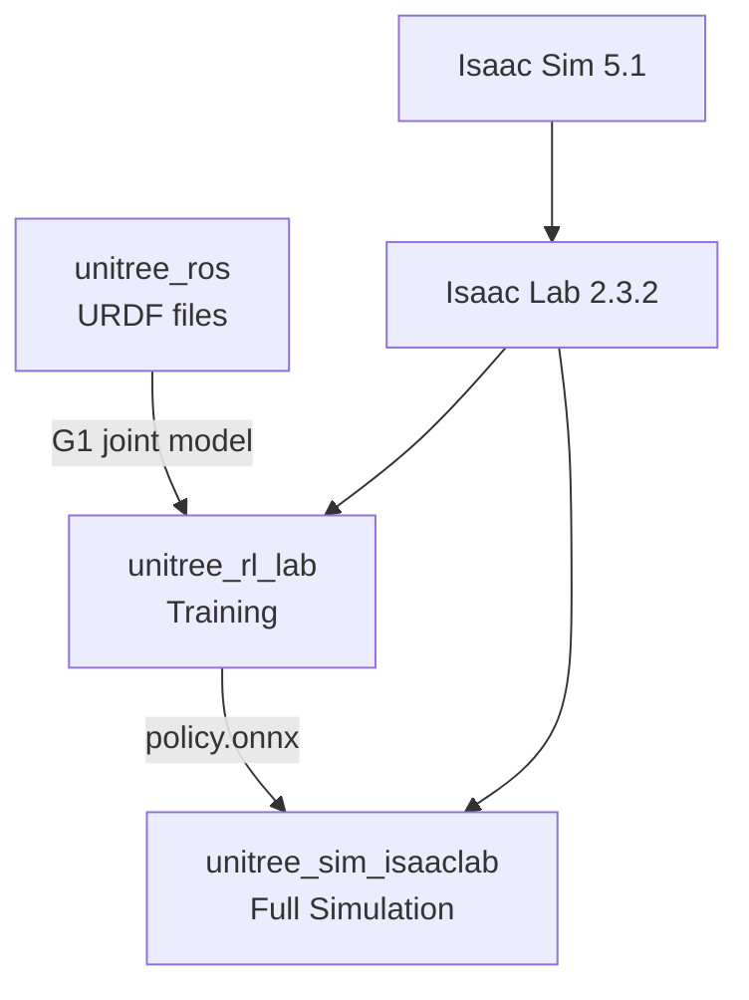

# RL Training Guide — G1 Locomotion from Scratch

Step-by-step reproduction guide for training the G1-29DOF locomotion policy and running it in simulation.

---

## Repositories

Three repos are needed. All live in `~/GIT/`.

| Repo | Purpose | Location |
|------|---------|----------|
| `unitree_rl_lab` | RL training framework (train, evaluate, export) | `~/GIT/unitree_rl_lab/` |
| `unitree_ros` | URDF robot description files (meshes, joints, physics) | `~/GIT/unitree_ros/` |
| `unitree_sim_isaaclab` | Full simulation environment for deployment testing | `~/GIT/unitree_sim_isaaclab/` |



---

## Prerequisites

Isaac Sim and Isaac Lab must be installed in the `isaaclab` conda environment before cloning the Unitree repos.

```bash
# 1. Install Isaac Sim 5.1 (requires Python 3.11 and GLIBC 2.35+)
conda activate isaaclab
pip install "isaacsim[all,extscache]==5.1.0" --extra-index-url https://pypi.nvidia.com

# 2. Clone and install Isaac Lab 2.3.2
git clone https://github.com/isaac-sim/IsaacLab.git
cd IsaacLab
./isaaclab.sh --install
```

---

## Step 1: Clone the Repos

```bash
cd ~/GIT
git clone https://github.com/unitreerobotics/unitree_rl_lab.git
git clone https://github.com/unitreerobotics/unitree_ros.git
git clone https://github.com/unitreerobotics/unitree_sim_isaaclab.git
```

---

## Step 2: Configure the URDF Path

`unitree_rl_lab` needs to know where the G1 URDF files live. Edit this file:

```
~/GIT/unitree_rl_lab/source/unitree_rl_lab/unitree_rl_lab/assets/robots/unitree.py
```

Set the path to the cloned `unitree_ros` directory:

```python
UNITREE_ROS_DIR = "/home/zeul/GIT/unitree_ros"
```

Then in the same file, switch the G1 29DOF config to use URDF instead of USD. Find the `UNITREE_G1_29DOF_CFG` section and:

- **Uncomment** `UnitreeUrdfFileCfg`
- **Comment out** `UnitreeUsdFileCfg`

This tells Isaac Lab to load the G1 from the URDF robot description instead of Unitree's pre-packaged USD scene file.

---

## Step 3: Install unitree_rl_lab

```bash
conda activate isaaclab
cd ~/GIT/unitree_rl_lab
pip install -e "source/unitree_rl_lab"
```

The `-e` flag installs in editable mode, so changes to the source files take effect immediately without reinstalling.

---

## Step 4: Train the Policy

```bash
conda activate isaaclab
cd ~/GIT/unitree_rl_lab
python scripts/rsl_rl/train.py --headless --task Unitree-G1-29dof-Velocity
```

`--headless` skips the GUI, which is much faster. 4,096 robots run in parallel on the GPU.

**What happens:**

1. Isaac Sim loads the G1 URDF and spawns 4,096 robots in a grid
2. Each robot gets a random velocity command each episode
3. Rewards and penalties are calculated every timestep
4. The neural network updates its weights based on what worked and what did not
5. Checkpoints are saved every 100 iterations to `logs/rsl_rl/unitree_g1_29dof_velocity/<timestamp>/`

Training runs until you stop it (Ctrl+C) or the reward plateaus. A usable policy typically emerges around iteration 1,000. We ran to 7,200.

### Resuming a Training Run

To continue from where you left off:

```bash
# Resume from latest checkpoint in a run
python scripts/rsl_rl/train.py --headless --task Unitree-G1-29dof-Velocity \
  --resume \
  --load_run 2026-03-06_14-30-46

# Resume from a specific checkpoint
python scripts/rsl_rl/train.py --headless --task Unitree-G1-29dof-Velocity \
  --resume \
  --load_run 2026-03-06_14-30-46 \
  --checkpoint model_7200.pt
```

The run folder name is the timestamp directory under `logs/rsl_rl/unitree_g1_29dof_velocity/`.

---

## Step 5: Monitor Training

In a second terminal while training runs:

```bash
conda activate isaaclab
cd ~/GIT/unitree_rl_lab
tensorboard --logdir logs/rsl_rl/ --host 0.0.0.0
```

Open [http://workstation:6006](http://workstation:6006) in a browser. Key metrics to watch:

| Metric | Good trend | What it means |
|--------|-----------|---------------|
| `Mean reward` | Increasing | Overall policy quality |
| `Episode_Termination/bad_orientation` | Decreasing toward 0 | Fall rate |
| `Episode_Reward/track_lin_vel_xy` | Increasing | Velocity command accuracy |
| `Episode_Length/mean` | Increasing toward max | Robots staying alive longer |

---

## Reward Configuration

The reward function is defined in:

```
~/GIT/unitree_rl_lab/source/unitree_rl_lab/unitree_rl_lab/tasks/locomotion/robots/g1/29dof/velocity_env_cfg.py
```

Positive terms (things the robot is rewarded for):

| Term | Weight | Description |
|------|--------|-------------|
| `track_lin_vel_xy` | +1.0 | Follow commanded forward/lateral speed |
| `track_ang_vel_z` | +0.5 | Follow commanded yaw (turning) rate |
| `alive` | +0.15 | Survive the episode without falling |
| `gait` | +0.5 | Maintain a natural alternating gait |
| `feet_clearance` | +1.0 | Lift feet cleanly off the ground |

Penalty terms (negative weights, things to minimize):

| Term | Weight | Description |
|------|--------|-------------|
| `flat_orientation_l2` | -5.0 | Penalizes tilting (stay upright) |
| `base_height` | -10.0 | Penalizes deviating from 0.78 m standing height |
| `dof_pos_limits` | -5.0 | Penalizes joints approaching their limits |
| `base_linear_velocity` (z) | -2.0 | Penalizes bouncing (vertical movement) |
| `joint_deviation_arms` | -0.1 | Keeps arms near default pose |
| `action_rate` | -0.05 | Penalizes rapid changes in joint targets |
| `energy` | -2e-5 | Penalizes unnecessary energy use |

To tune the policy behavior, change these weights. Increasing `track_lin_vel_xy` makes the robot prioritize speed over stability. Increasing `flat_orientation_l2` makes it more conservative about tilting. Weights are just floating point numbers in that config file.

---

## Step 6: Play Back the Trained Policy

To run the policy in simulation with a GUI:

```bash
conda activate isaaclab
cd ~/GIT/unitree_rl_lab

# Basic playback — loads latest checkpoint, opens GUI
python scripts/rsl_rl/play.py --task Unitree-G1-29dof-Velocity

# Control how many robots are shown (default is 32 or so)
python scripts/rsl_rl/play.py --task Unitree-G1-29dof-Velocity --num_envs 30

# Load a specific checkpoint (instead of the latest)
python scripts/rsl_rl/play.py --task Unitree-G1-29dof-Velocity \
  --load_run 2026-03-06_14-30-46 \
  --checkpoint model_7200.pt

# Record a video of the playback
python scripts/rsl_rl/play.py --task Unitree-G1-29dof-Velocity \
  --video --video_length 300
```

This loads the checkpoint from `logs/rsl_rl/unitree_g1_29dof_velocity/` and opens a GUI window. The Isaac Sim viewport shows the robots walking. Use the keyboard or gamepad to send velocity commands.

!!! note "Requires a display"
    `play.py` opens the full Isaac Sim GUI. Run it from a desktop session (Sunshine/Moonlight remote desktop), not from an SSH terminal. For headless playback with video recording, add `--headless --video`.

---

## Output Files

After training, checkpoints are saved here:

```
~/GIT/unitree_rl_lab/logs/rsl_rl/unitree_g1_29dof_velocity/2026-03-06_14-30-46/
├── exported/
│   ├── policy.onnx       <- portable policy, deploy this
│   └── policy.pt         <- PyTorch checkpoint, for fine-tuning
├── params/
│   ├── velocity_env_cfg.py   <- full environment config snapshot
│   └── deploy.yaml           <- PD gains, joint order, obs scaling
├── model_100.pt          <- checkpoint at iter 100
├── model_200.pt          <- checkpoint at iter 200
│   ...
└── model_7200.pt         <- final checkpoint
```

The `policy.onnx` file is what gets deployed. It is a portable format that runs on any machine with ONNX Runtime -- the workstation, the Jetson, or a laptop.

---

## Step 7: Deploy in unitree_sim_isaaclab

Copy the trained JIT policy to the simulation environment:

```bash
cp ~/GIT/unitree_rl_lab/logs/rsl_rl/unitree_g1_29dof_velocity/2026-03-06_14-30-46/exported/policy.pt \
   ~/GIT/unitree_sim_isaaclab/assets/model/our_policy.pt
```

### Launch the simulation

The custom task `Isaac-Locomotion-G129-Warehouse` loads the exact same robot config as training (URDF, actuator stiffness/damping, joint defaults) inside a warehouse scene.

```bash
conda activate isaaclab
cd ~/GIT/unitree_sim_isaaclab
python sim_main.py --device cuda:0 --enable_cameras \
  --task Isaac-Locomotion-G129-Warehouse \
  --action_source custom_rl \
  --model_path assets/model/our_policy.pt \
  --robot_type g129 \
  --camera_include front_camera \
  --enable_wholebody_dds
```

### Control the robot with keyboard

In a separate terminal:

```bash
conda activate isaaclab
cd ~/GIT/unitree_sim_isaaclab
python send_commands_keyboard.py
```

Controls (the terminal with the keyboard script must have focus):

| Key | Action |
|-----|--------|
| W/S | Forward / Backward |
| A/D | Strafe left / right |
| Z/X | Turn left / right |
| C | Crouch |
| Q | Quit |

### How it works

The v2 action provider (`action_provider_custom_rl_v2.py`) uses Isaac Lab's own `ObservationManager` and `ActionManager` to construct observations and apply actions. This guarantees identical behavior to training -- no manual observation construction, no action scaling bugs, no joint ordering issues.

The provider reads velocity commands from DDS (keyboard or Nav2), overrides the env's command manager, then runs the standard Isaac Lab pipeline: compute observations, run the policy, process and apply actions, step physics.

### Alternative: Quick demo without DDS

For a quick demo without DDS or keyboard control (robot follows random velocity commands):

```bash
conda activate isaaclab
cd ~/GIT/unitree_rl_lab
python scripts/rsl_rl/play_warehouse.py --num_envs 1
```

This uses Isaac Lab's built-in `env.step()` loop with the training config and a warehouse terrain.

---

## Quick Reference

```bash
conda activate isaaclab
cd ~/GIT/unitree_rl_lab

# Start a new training run
python scripts/rsl_rl/train.py --headless --task Unitree-G1-29dof-Velocity

# Resume a training run
python scripts/rsl_rl/train.py --headless --task Unitree-G1-29dof-Velocity \
  --resume --load_run 2026-03-06_14-30-46

# Stop training
Ctrl+C

# Monitor training (open http://workstation:6006)
tensorboard --logdir logs/rsl_rl/ --host 0.0.0.0

# Play back with 20 robots visible
python scripts/rsl_rl/play.py --task Unitree-G1-29dof-Velocity --num_envs 20

# Play in warehouse (quick demo, random velocity commands)
python scripts/rsl_rl/play_warehouse.py --num_envs 1

# Trained policy location
ls logs/rsl_rl/unitree_g1_29dof_velocity/2026-03-06_14-30-46/exported/

# Deploy in unitree_sim_isaaclab with DDS keyboard control
cd ~/GIT/unitree_sim_isaaclab
python sim_main.py --device cuda:0 --enable_cameras \
  --task Isaac-Locomotion-G129-Warehouse \
  --action_source custom_rl \
  --model_path assets/model/our_policy.pt \
  --robot_type g129 --camera_include front_camera \
  --enable_wholebody_dds

# Keyboard control (separate terminal)
python send_commands_keyboard.py
```

---

## About `Unitree-G1-29dof-Velocity`

This is a **Gymnasium task ID** -- a registered name that maps to the full environment configuration. It was created by Unitree and ships inside `unitree_rl_lab`.

When you pass `--task Unitree-G1-29dof-Velocity`, it looks up this registration:

```python
# source/unitree_rl_lab/unitree_rl_lab/tasks/locomotion/robots/g1/29dof/__init__.py
gym.register(
    id="Unitree-G1-29dof-Velocity",
    kwargs={
        "env_cfg_entry_point":    "velocity_env_cfg:RobotEnvCfg",
        "rsl_rl_cfg_entry_point": "rsl_rl_ppo_cfg:BasePPORunnerCfg",
    },
)
```

The two files it points to are where the actual configuration lives:

| File | What it controls |
|------|-----------------|
| `tasks/locomotion/robots/g1/29dof/velocity_env_cfg.py` | Robot, terrain, observations, reward weights |
| `tasks/locomotion/agents/rsl_rl_ppo_cfg.py` | Learning rate, batch size, network size, iterations |

To make the robot do something different, modify `velocity_env_cfg.py`. `train.py` itself is just a launcher -- you do not edit it.
